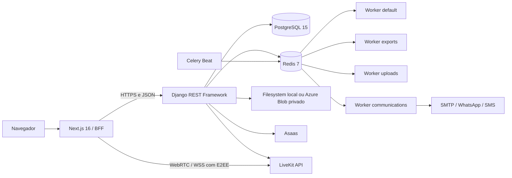

# Elo Terapêutico

Plataforma SaaS de gestão para terapeutas e profissionais de saúde, reunindo agenda, pacientes, prontuário eletrônico, telemedicina, financeiro clínico, documentos, formulários, comunicações, relatórios e cobrança de assinaturas.

> **Situação atual:** desenvolvimento ativo e pré-produção. O repositório contém uma base funcional ampla, mas integrações externas, infraestrutura, backup, observabilidade e controles operacionais ainda precisam ser validados antes do uso com dados clínicos reais.

## Visão geral

O Elo Terapêutico centraliza atividades clínicas e administrativas que normalmente ficam distribuídas entre agendas, planilhas, arquivos e serviços de comunicação. O produto atende profissionais autônomos e organizações com equipe, utilizando `apps.organizations` para organização, memberships, papéis, convites e contexto multi-tenant.

A existência de código para uma integração não significa que ela esteja operacional. Asaas, Azure Blob, SMTP, WhatsApp Business, SMS e LiveKit exigem credenciais, infraestrutura e validação em staging.

## Módulos

| Módulo | Finalidade | Situação resumida |
| --- | --- | --- |
| Autenticação e usuários | Login, cadastro, recuperação, JWT, cookies HttpOnly, CSRF e perfis | Implementado; exige validação contínua de segurança |
| Organizações | Tenant, memberships, papéis, convites, onboarding e configurações | Implementado parcialmente; ownership legado ainda requer revisão transversal |
| Pacientes | Cadastro, responsáveis, lifecycle, importação e exportação | Implementado parcialmente |
| Prontuário | Anamnese, evoluções, aditivos, metas, anexos e exportações | Implementado parcialmente; dados clínicos exigem operação endurecida |
| Agenda | Consultas, recorrências, salas, bloqueios, pacotes e lembretes | Implementado parcialmente |
| Telemedicina | Salas, convites, consentimento, áudio/vídeo LiveKit, E2EE e webhooks | Implementado, dependente de configuração e staging |
| Financeiro clínico | Receitas, despesas, pagamentos, mensalidades e relatórios | Implementado parcialmente |
| Documentos | Templates, biblioteca, geração, hash e arquivos privados | Implementado, dependente de storage privado em produção |
| Formulários | Templates, submissões e respostas | Implementado parcialmente |
| Comunicações | Notificações, e-mail, WhatsApp manual, templates, automações e fila Celery | Implementado, dependente de provedores externos para canais oficiais |
| Relatórios | Agregações, indicadores e exportações | Implementado parcialmente |
| Billing SaaS | Planos, checkout, assinatura, pagamentos, entitlements e Asaas | Implementado, dependente de gateway e webhooks válidos |
| Auditoria | Trilha de ações sensíveis e sanitização de metadados | Implementado parcialmente |
| Administração | Django Admin com Django Unfold | Implementado; permissões operacionais exigem revisão |
| Portal do paciente | Experiência autenticada exclusiva do paciente | Não implementado como domínio completo |
| Inteligência artificial | Assistência administrativa ou clínica revisável | Planejada; sem provedor ou fluxo funcional |

Consulte a [matriz de módulos](docs/17-referencia/matriz-de-modulos.md) para maturidade, testes, integrações e pendências.

## Arquitetura



- **Frontend:** Next.js App Router, React, TypeScript, Tailwind CSS, TanStack Query e componentes LiveKit.
- **BFF:** Route Handlers mantêm access e refresh tokens em cookies `HttpOnly`, aplicam proteção CSRF e encaminham chamadas autenticadas ao backend.
- **Backend:** Django, Django REST Framework, Simple JWT, OpenAPI, services/selectors e integrações isoladas.
- **Persistência:** PostgreSQL é a referência do Docker, CI e produção.
- **Assíncrono:** Redis, quatro filas Celery especializadas e Celery Beat.
- **Arquivos:** filesystem no desenvolvimento; Azure Blob privado é a opção prevista para produção.
- **Multi-tenancy:** organização e membership explícitas; produção ativa autenticação tenant-aware.

Leia a [arquitetura geral](docs/02-arquitetura/arquitetura-geral.md), o [processamento assíncrono](docs/02-arquitetura/filas-e-processamento-assincrono.md) e o [padrão dos apps Django](docs/backend/app-architecture.md).

## Tecnologias principais

### Backend

- Python 3.12;
- Django `>=6.0.7,<6.1`;
- Django REST Framework `>=3.17.1,<3.18`;
- PostgreSQL 15;
- Redis 7 e Celery;
- Simple JWT, django-filter, django-cors-headers e django-ratelimit;
- drf-spectacular para OpenAPI;
- WeasyPrint para PDF;
- cryptography/Fernet e Argon2;
- LiveKit API;
- Azure Blob por `django-storages` em produção;
- Gunicorn, WhiteNoise, Structlog e health checks em produção;
- Django Unfold no backoffice.

### Frontend

- Node.js 24;
- Next.js 16.2.9;
- React 19;
- TypeScript 6;
- Tailwind CSS 4;
- Axios e TanStack Query;
- React Hook Form e Zod;
- Radix UI, Lucide React, Framer Motion e Sonner;
- LiveKit Client e LiveKit Components;
- Playwright para fluxos E2E isolados.

O inventário completo está em [Inventário tecnológico](docs/17-referencia/inventario-tecnologico.md).

## Início rápido com Docker

### Requisitos

- Git;
- Docker Engine ou Docker Desktop;
- Docker Compose v2.

Na raiz do repositório:

```bash
cp .env.example .env
# substitua todos os placeholders obrigatórios

docker compose config
docker compose up --build
```

Serviços publicados no host:

- frontend: `http://localhost:3000`;
- backend/API: `http://localhost:8000/api/v1/`;
- Swagger: `http://localhost:8000/api/docs/`;
- ReDoc: `http://localhost:8000/api/redoc/`;
- Django Admin: `http://localhost:8000/admin/`;
- PostgreSQL: `127.0.0.1:5432`;
- Redis: `127.0.0.1:6379`.

O Compose atual é voltado ao desenvolvimento e validação local. Ele sobrescreve os comandos das imagens para usar `runserver` e `next dev`, monta o código como volume e não deve ser tratado como topologia final de produção.

## Containers do Compose

| Serviço | Responsabilidade |
| --- | --- |
| `db` | PostgreSQL e persistência em `db_data` |
| `redis` | Broker, resultados Celery e persistência AOF em `redis_data` |
| `backend` | API Django, migrations locais, Admin, OpenAPI e health checks |
| `frontend` | Next.js, BFF e interface web |
| `celery-worker-default` | Billing, webhooks, reconciliação, scheduling e manutenção geral |
| `celery-worker-exports` | Exportações clínicas e ciclo de vida dos arquivos exportados |
| `celery-worker-uploads` | Verificação, recuperação e limpeza de uploads clínicos |
| `celery-worker-communications` | Comunicações, tentativas, notificações e automações |
| `celery-beat` | Publicação das tarefas periódicas nas filas corretas |

Consulte [Instalação com Docker](docs/03-instalacao/instalacao-docker.md) e a [Matriz de containers](docs/17-referencia/matriz-de-containers.md).

## Execução sem Docker

### Backend

```bash
cd backend
python -m venv .venv
```

Linux/macOS:

```bash
source .venv/bin/activate
python -m pip install --upgrade pip
python -m pip install -r requirements.txt
cp .env.example .env
python manage.py migrate
python manage.py createsuperuser
python manage.py runserver 0.0.0.0:8000
```

Windows PowerShell:

```powershell
.\.venv\Scripts\Activate.ps1
python -m pip install --upgrade pip
python -m pip install -r requirements.txt
Copy-Item .env.example .env
python manage.py migrate
python manage.py createsuperuser
python manage.py runserver 0.0.0.0:8000
```

### Frontend

```bash
cd frontend
npm ci
cp .env.example .env.local
npm run dev
```

Ao executar fora do Docker, `BACKEND_API_URL` deve apontar para o backend acessível pelo processo Next.js. Variáveis `NEXT_PUBLIC_*` são incorporadas ao bundle e nunca podem conter segredos.

## Testes e qualidade

Backend:

```bash
cd backend
python apps/core/quality/check_backend_architecture.py
python manage.py check
python manage.py makemigrations --check --dry-run
python manage.py spectacular --file schema.yml --validate
ruff check .
mypy .
pytest --create-db
```

Frontend:

```bash
cd frontend
npm ci
npm run lint
npm run typecheck
npm test
npm run test:coverage
npm run test:auth
npm run build
```

Documentação e Compose:

```bash
python scripts/validate_docs.py
docker compose config
docker compose config --services
```

Os números de cobertura variam por commit e não constituem garantia permanente. Consulte [Testes e qualidade](docs/10-testes/README.md).

## Segurança, privacidade e produção

Entre os controles presentes estão JWT com rotação e blacklist, Argon2, cookies HttpOnly, CSRF, criptografia de campos sensíveis, auditoria sanitizada, validação de uploads, tokens públicos persistidos por hash, E2EE da telemedicina e isolamento por organização.

Esses controles não comprovam conformidade jurídica integral nem prontidão automática para dados reais. Produção exige, no mínimo:

- HTTPS e proxy confiável;
- segredos fortes, distintos e armazenados fora do Git;
- PostgreSQL e Redis protegidos;
- storage privado persistente;
- backup e restauração testados;
- monitoramento, alertas e runbooks;
- provedores externos validados em staging;
- revisão de permissões e isolamento entre organizações;
- avaliação jurídica e operacional aplicável.

Leia [Segurança](docs/08-seguranca/README.md), [LGPD](docs/09-lgpd/README.md) e [Limitações conhecidas](docs/01-visao-geral/limitacoes.md).

## Estrutura do repositório

```text
EloTerapeutico/
├── backend/                 # Django REST API, Celery e backoffice
├── frontend/                # Next.js App Router, BFF e testes E2E
├── docs/                    # Portal técnico, funcional e operacional
├── scripts/                 # Validações e utilitários do repositório
├── .github/workflows/       # CI, segurança e validações
├── docker-compose.yml       # Ambiente local
├── .env.example             # Ambiente canônico do Compose
├── AGENTS.md                # Regras para agentes e colaboradores
└── README.md
```

## Documentação

O portal oficial está em [`docs/README.md`](docs/README.md). Referências principais:

- [Status do projeto](docs/17-referencia/status-do-projeto.md);
- [Matriz de módulos](docs/17-referencia/matriz-de-modulos.md);
- [Matriz de integrações](docs/17-referencia/matriz-de-integracoes.md);
- [Matriz de containers](docs/17-referencia/matriz-de-containers.md);
- [Inventário tecnológico](docs/17-referencia/inventario-tecnologico.md);
- [Variáveis de ambiente](docs/04-configuracao/variaveis-de-ambiente.md);
- [Telemedicina](docs/05-modulos/telemedicina/README.md);
- [Comunicações](docs/05-modulos/comunicacoes/README.md);
- [Organizações e multi-tenancy](docs/05-modulos/organizacoes/README.md).

## Auditoria documental

- **Data:** 23/07/2026;
- **Branch analisada:** `main`;
- **Commit-base:** `75827a2dbfe7d4f86f0865f05d9a5a8f660e0f78`;
- **Escopo:** documentação técnica, funcional, arquitetural e operacional;
- **Fonte de verdade:** código, migrations, testes, configurações, Docker, workflows e dependências do commit analisado.

Mudanças funcionais devem atualizar a documentação correspondente no mesmo Pull Request.