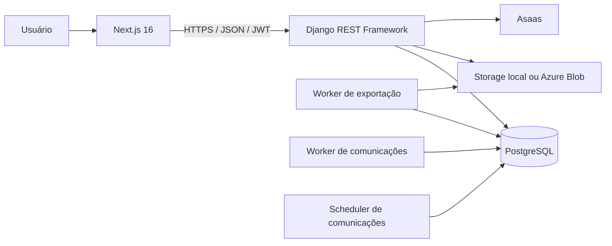

# Elo Terapêutico

Plataforma web de gestão para profissionais de saúde e terapeutas, com agenda, pacientes, prontuário eletrônico, financeiro, documentos, formulários, comunicações, relatórios e cobrança de assinaturas.

> **Situação atual:** projeto em desenvolvimento ativo. A base funcional é ampla, mas ainda existem requisitos operacionais e riscos que precisam ser tratados antes de uso com dados clínicos reais em produção.

## Índice

- [Visão geral](#visão-geral)
- [Módulos](#módulos)
- [Arquitetura](#arquitetura)
- [Tecnologias](#tecnologias)
- [Início rápido](#início-rápido)
- [Docker](#docker)
- [Testes e qualidade](#testes-e-qualidade)
- [Segurança e dados clínicos](#segurança-e-dados-clínicos)
- [Documentação](#documentação)
- [Contribuição](#contribuição)
- [Limitações conhecidas](#limitações-conhecidas)

## Visão geral

O Elo Terapêutico centraliza tarefas administrativas e clínicas que normalmente ficam distribuídas entre agendas, planilhas, arquivos e sistemas de cobrança. O público principal é composto por terapeutas e profissionais que realizam atendimentos individuais, em grupo, presenciais ou remotos.

O código atual implementa isolamento de diversos recursos pelo profissional autenticado. Entretanto, **não existe uma entidade explícita de clínica/tenant** que permita afirmar que uma arquitetura multi-clínica está concluída. Consulte [escopo e limitações](docs/01-visao-geral/escopo-atual.md).

## Módulos

| Módulo | Situação resumida |
| --- | --- |
| Autenticação e usuários | Implementado, com JWT, rotação, blacklist, bloqueio e redefinição de senha |
| Pacientes | Implementado, com cadastro, responsáveis, status, importação/exportação e arquivamento lógico |
| Prontuário | Implementado, com anamnese, evoluções, aditivos, documentos, anexos, metas e exportações |
| Agenda | Implementado, com consultas, recorrências, salas, bloqueios, pacotes, lembretes e telemedicina |
| Financeiro | Implementado, com receitas, despesas, mensalidades, pagamentos e relatórios |
| Documentos | Implementado, com modelos, biblioteca, geração e integridade por hash |
| Formulários | Implementado, com construtor, templates, submissões e respostas |
| Comunicações | Implementado com notificações internas, e-mail, WhatsApp manual, templates, automações, fila persistente e links públicos seguros |
| Relatórios | Implementado para consultas, pacientes, financeiro, agendamento online e exportação |
| Billing | Implementado com planos, assinaturas, pagamentos e integração Asaas |
| Auditoria | Implementado para ações sensíveis, com registros imutáveis no modelo |
| Administração | Implementado com Django Admin e Django Unfold |
| Dashboard | Implementado no frontend, agregando dados dos módulos |

Detalhes e pendências estão na [matriz de módulos](docs/17-referencia/matriz-de-modulos.md).

## Arquitetura



- **Frontend:** Next.js App Router, React, TypeScript, Tailwind CSS e TanStack Query.
- **Backend:** Django, Django REST Framework e Simple JWT.
- **Banco:** PostgreSQL em Docker/produção; SQLite pode ser usado no desenvolvimento e nos testes.
- **Processamento assíncrono:** filas persistidas no banco para exportações clínicas e comunicações, processadas por management commands.
- **Arquivos:** filesystem no desenvolvimento; Azure Blob pode ser configurado em produção.

Leia a [visão geral de arquitetura](docs/02-arquitetura/README.md), o [mapa dos apps](docs/architecture/backend-architecture-map.md) e as [convenções de camadas do backend](docs/backend-architecture.md).

## Tecnologias

### Backend

- Python 3.12 na imagem Docker;
- Django `>=5.0,<5.2`;
- Django REST Framework `>=3.15,<3.16`;
- PostgreSQL 15 no Docker Compose;
- Simple JWT, django-filter, drf-spectacular e django-ratelimit;
- WeasyPrint para PDFs;
- cryptography/Fernet para campos textuais sensíveis;
- Django Unfold para o backoffice.

### Frontend

- Node.js 24 na imagem Docker e no workflow de CI;
- Next.js 16.2.9;
- React 19.2.4;
- TypeScript 6;
- Tailwind CSS 4;
- Axios, TanStack Query, React Hook Form e Zod.

## Início rápido

### Requisitos

- Git;
- Python 3.12 recomendado;
- Node.js 24 recomendado;
- PostgreSQL 15+ ou SQLite para desenvolvimento;
- bibliotecas nativas do WeasyPrint quando executar fora do Docker.

### Backend sem Docker

```bash
cd backend
python -m venv .venv
```

Linux/macOS:

```bash
source .venv/bin/activate
python -m pip install --upgrade pip
python -m pip install -r requirements.txt
cp .env.example .env
python manage.py migrate
python manage.py createsuperuser
python manage.py runserver 0.0.0.0:8000
```

Windows PowerShell:

```powershell
.\.venv\Scripts\Activate.ps1
python -m pip install --upgrade pip
python -m pip install -r requirements.txt
Copy-Item .env.example .env
python manage.py migrate
python manage.py createsuperuser
python manage.py runserver 0.0.0.0:8000
```

### Frontend sem Docker

```bash
cd frontend
npm ci
```

Crie `frontend/.env.local`:

```text
NEXT_PUBLIC_API_URL=http://localhost:8000/api/v1/
```

Depois execute:

```bash
npm run dev
```

Acesse `http://localhost:3000`. A API fica em `http://localhost:8000/api/v1/` e a documentação OpenAPI em `http://localhost:8000/api/docs/`.

Para processar comunicações sem Docker, execute em terminais separados:

```bash
cd backend
python manage.py process_communications --sleep 5
python manage.py schedule_communication_automations
```

## Docker

Na raiz do repositório:

```bash
cp .env.example .env
# preencha POSTGRES_PASSWORD e os segredos obrigatórios
docker compose up --build
```

Serviços disponíveis:

- frontend: porta `3000`;
- backend: porta `8000`;
- PostgreSQL: exposto apenas em `127.0.0.1:5432`;
- worker de exportações clínicas;
- `communications-worker` para a fila persistente de envios;
- `communications-scheduler` para automações, retentativas e limpeza de tokens.

Consulte o [guia Docker](docs/03-instalacao/instalacao-docker.md) e a [operação do módulo de Comunicações](docs/05-modulos/comunicacoes/README.md).

## Testes e qualidade

Backend:

```bash
cd backend
pytest --create-db
python manage.py check
python manage.py makemigrations --check --dry-run
ruff check .
mypy .
```

Frontend:

```bash
cd frontend
npm ci
npm run lint
npm run typecheck
npm test
npm run build
```

Os números de cobertura variam por commit e não são apresentados como garantia permanente. Veja [testes e qualidade](docs/10-testes/README.md).

## Segurança e dados clínicos

O projeto contém controles de segurança, mas não deve ser considerado automaticamente pronto para produção. Entre os controles implementados estão:

- Argon2 como primeiro password hasher;
- JWT com rotação e blacklist de refresh tokens;
- bloqueio de conta após tentativas falhas;
- campos clínicos textuais criptografados antes da persistência;
- regras específicas para evoluções confidenciais;
- validação de extensão, MIME e assinatura de uploads clínicos;
- auditoria de ações sensíveis;
- destinos de comunicação criptografados e mascarados;
- tokens públicos de comunicação persistidos somente como hash, com expiração e uso único;
- templates de mensagens limitados a variáveis administrativas permitidas;
- validação de segredos e headers de segurança no settings de produção.

Antes de armazenar dados reais, configure HTTPS, segredos independentes, PostgreSQL gerenciado, storage privado persistente, backup, monitoramento, e-mail e token de webhook. Também revise o risco de tokens JWT acessíveis ao JavaScript no frontend.

Leia o [guia de segurança](docs/08-seguranca/README.md), o [mapeamento técnico de LGPD](docs/09-lgpd/README.md) e a [documentação de Comunicações](docs/05-modulos/comunicacoes/README.md).

## Estrutura do projeto

```text
EloTerapeutico/
├── backend/                 # Django REST API, workers e backoffice
├── frontend/                # Next.js App Router
├── docs/                    # Portal técnico e operacional
├── docker-compose.yml       # Ambiente local
├── AGENTS.md                # Regras para agentes e colaboradores
└── README.md
```

## Documentação

O portal principal está em [`docs/README.md`](docs/README.md). Ele organiza documentação para:

- desenvolvimento e contribuição;
- arquitetura e API;
- segurança e LGPD;
- instalação, deploy e operação;
- suporte e troubleshooting;
- módulos e casos de uso;
- decisões arquiteturais.

Referências diretas para desenvolvimento do backend:

- [convenções de camadas, dependências, multi-tenant e transações](docs/backend-architecture.md);
- [mapa atual dos apps e responsabilidades](docs/architecture/backend-architecture-map.md);
- [testes e verificações de qualidade](docs/10-testes/README.md).

Documentação específica do módulo de Comunicações:

- [arquitetura, canais, fila, APIs, segurança e operação](docs/05-modulos/comunicacoes/README.md).

## Contribuição

Não altere diretamente a `main`. Use uma branch específica, commits pequenos em português e Pull Request. Antes de enviar, execute os checks relevantes e verifique migrations.

Consulte [como contribuir](docs/14-contribuicao/README.md).

## Limitações conhecidas

- multi-tenancy por clínica não está concluído;
- o frontend mantém JWTs em cookies acessíveis ao JavaScript;
- storage privado e persistente depende de configuração operacional;
- e-mail real depende de SMTP em produção;
- WhatsApp Business e SMS dependem da seleção e configuração de provedores oficiais;
- confirmações externas de entrega e leitura dependem de webhook autenticado do provedor;
- Asaas depende de credenciais e webhook configurados;
- a suíte frontend é menor que a cobertura backend;
- backup, restauração e observabilidade dependem do ambiente de implantação;
- recursos de IA clínica não devem ser tratados como diagnóstico ou decisão autônoma.

Veja a lista completa em [limitações](docs/01-visao-geral/limitacoes.md).

## Licenciamento

O repositório não contém um arquivo `LICENSE` na revisão documentada. Não presuma permissão de redistribuição ou uso comercial sem autorização do mantenedor.

## Mantenedor

Repositório mantido por [FlavioProgramador](https://github.com/FlavioProgramador).
