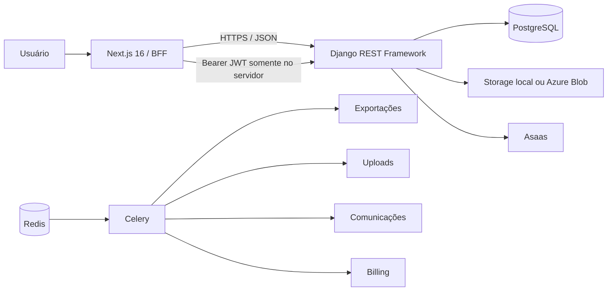

# Elo Terapêutico

Plataforma web de gestão para profissionais de saúde e terapeutas, com agenda, pacientes, prontuário eletrônico, financeiro clínico, documentos, formulários, comunicações, relatórios e cobrança de assinaturas.

> **Situação atual:** desenvolvimento ativo e pré-produção. A base funcional é ampla, mas ainda existem bloqueadores arquiteturais e requisitos operacionais antes do uso com dados clínicos reais.

## Índice

- [Visão geral](#visão-geral)
- [Módulos](#módulos)
- [Arquitetura](#arquitetura)
- [Tecnologias](#tecnologias)
- [Início rápido](#início-rápido)
- [Docker](#docker)
- [Testes e qualidade](#testes-e-qualidade)
- [Segurança e dados clínicos](#segurança-e-dados-clínicos)
- [Documentação](#documentação)
- [Contribuição](#contribuição)
- [Limitações conhecidas](#limitações-conhecidas)

## Visão geral

O Elo Terapêutico centraliza tarefas administrativas e clínicas que normalmente ficam distribuídas entre agendas, planilhas, arquivos e sistemas de cobrança. O público principal é composto por terapeutas e profissionais que realizam atendimentos individuais, em grupo, presenciais ou remotos.

O código atual implementa isolamento de diversos recursos pelo profissional autenticado. Entretanto, **não existe uma entidade explícita de clínica/tenant** que permita afirmar que uma arquitetura multi-clínica está concluída. Consulte [escopo e limitações](docs/01-visao-geral/escopo-atual.md).

## Módulos

| Módulo | Situação resumida |
| --- | --- |
| Autenticação e usuários | JWT, rotação, blacklist, lockout, reset e BFF Next.js com cookies HttpOnly e CSRF |
| Pacientes | Cadastro, responsáveis, status, importação/exportação e arquivamento lógico; ainda isolado principalmente por terapeuta |
| Prontuário | Anamnese, evoluções, aditivos, documentos, anexos, metas e exportações; exige controles operacionais adicionais |
| Agenda | Consultas, recorrências, salas, bloqueios, pacotes e lembretes; timezone/concorrência ainda precisam de validação dedicada |
| Telemedicina | Sala lógica, tokens e acesso temporário; **não possui áudio/vídeo em tempo real** |
| Financeiro clínico | Receitas, despesas, mensalidades, pagamentos e relatórios |
| Documentos | Modelos, biblioteca, geração e integridade por hash; storage privado depende da infraestrutura |
| Formulários | Construtor, templates, submissões e respostas |
| Comunicações | Notificações, templates, automações, Celery e webhooks; canais externos dependem de provedores |
| Relatórios | Consultas, pacientes, financeiro, agendamento e exportações |
| Billing | Planos, preços, assinaturas, entitlements, pagamentos e integração configurável com Asaas |
| Auditoria | Trilha para ações sensíveis; refatoração específica em andamento |
| Administração | Django Admin e Django Unfold |
| Dashboard | Agregação frontend dos módulos, com cobertura parcial |
| Portal do paciente | Não implementado como módulo completo |
| Inteligência artificial | Planejada; existe somente flag comercial e placeholder, sem integração funcional |

Detalhes, maturidade e pendências estão na [matriz de módulos](docs/17-referencia/matriz-de-modulos.md).

## Arquitetura



- **Frontend:** Next.js App Router, React, TypeScript, Tailwind CSS e TanStack Query.
- **BFF:** Route Handlers do Next.js guardam access/refresh em cookies `HttpOnly`, aplicam double-submit CSRF e adicionam `Authorization` somente no servidor.
- **Backend:** Django, Django REST Framework e Simple JWT.
- **Banco:** PostgreSQL 15 no Docker e no CI principal; SQLite pode ser usado somente em cenários locais específicos.
- **Processamento assíncrono:** Redis, Celery workers separados e Celery Beat.
- **Arquivos:** filesystem no desenvolvimento; Azure Blob privado deve ser configurado em produção.

Leia a [visão geral de arquitetura](docs/02-arquitetura/README.md), o [mapa dos apps](docs/architecture/backend-architecture-map.md) e as [convenções de camadas](docs/backend-architecture.md).

## Tecnologias

### Backend

- Python 3.12;
- Django `>=6.0.7,<6.1`;
- Django REST Framework `>=3.17.1,<3.18`;
- PostgreSQL 15;
- Redis e Celery;
- Simple JWT, django-filter, drf-spectacular e django-ratelimit;
- WeasyPrint para PDFs;
- cryptography/Fernet para campos textuais sensíveis;
- Django Unfold para o backoffice.

### Frontend

- Node.js 24;
- Next.js 16.2.9;
- React 19;
- TypeScript 6;
- Tailwind CSS 4;
- Axios, TanStack Query, React Hook Form e Zod;
- Playwright isolado para autenticação E2E.

## Início rápido

### Requisitos

- Git;
- Python 3.12;
- Node.js 24;
- PostgreSQL 15+ ou ambiente Docker;
- Redis para Celery/cache;
- bibliotecas nativas do WeasyPrint quando executar fora do Docker.

### Backend sem Docker

```bash
cd backend
python -m venv .venv
```

Linux/macOS:

```bash
source .venv/bin/activate
python -m pip install --upgrade pip
python -m pip install -r requirements.txt
cp .env.example .env
python manage.py migrate
python manage.py createsuperuser
python manage.py runserver 0.0.0.0:8000
```

Windows PowerShell:

```powershell
.\.venv\Scripts\Activate.ps1
python -m pip install --upgrade pip
python -m pip install -r requirements.txt
Copy-Item .env.example .env
python manage.py migrate
python manage.py createsuperuser
python manage.py runserver 0.0.0.0:8000
```

### Frontend sem Docker

```bash
cd frontend
npm ci
```

Crie `frontend/.env.local`:

```text
BACKEND_API_URL=http://localhost:8000/api/v1/
NEXT_PUBLIC_API_URL=http://localhost:8000/api/v1/
```

Depois execute:

```bash
npm run dev
```

Acesse `http://localhost:3000`. A API fica em `http://localhost:8000/api/v1/` e a documentação OpenAPI em `http://localhost:8000/api/docs/`.

Para processamento assíncrono, execute workers/beat do Celery ou utilize o Docker Compose.

## Docker

Na raiz do repositório:

```bash
cp .env.example .env
# preencha POSTGRES_PASSWORD, REDIS_PASSWORD e os segredos obrigatórios
docker compose up --build
```

Serviços principais:

- frontend: porta `3000`;
- backend: porta `8000`;
- PostgreSQL: exposto apenas em `127.0.0.1:5432`;
- Redis: exposto apenas em `127.0.0.1:6379`;
- workers Celery para `default`, `exports` e `communications`;
- Celery Beat para tarefas periódicas.

Consulte o [guia Docker](docs/03-instalacao/instalacao-docker.md) e a [operação de Comunicações](docs/05-modulos/comunicacoes/README.md).

## Testes e qualidade

Backend:

```bash
cd backend
python apps/core/quality/check_backend_architecture.py
python manage.py check
python manage.py makemigrations --check --dry-run
python manage.py migrate --noinput
ruff check .
mypy .
pytest --create-db
```

O workflow principal executa migrations e testes sobre PostgreSQL 15. Ruff e mypy são gates obrigatórios.

Frontend:

```bash
cd frontend
npm ci
npm run lint
npm run typecheck
npm test
npm run build
```

Autenticação unitária:

```bash
npm run test:auth
```

Autenticação E2E, com aplicações já iniciadas e variáveis de usuário sintético configuradas:

```bash
cd frontend/e2e
npm install
npx playwright install chromium
npm run test:auth
```

O workflow `.github/workflows/auth-e2e.yml` provisiona PostgreSQL, backend e frontend reais e valida cookies HttpOnly, CSRF, refresh, logout e falha segura do gateway.

Os números de cobertura variam por commit e não são apresentados como garantia permanente. Veja [testes e qualidade](docs/10-testes/README.md).

## Segurança e dados clínicos

O projeto contém controles de segurança, mas não deve ser considerado automaticamente pronto para produção. Entre os controles implementados estão:

- Argon2 como primeiro password hasher;
- JWT com rotação e blacklist de refresh tokens;
- cookies access/refresh `HttpOnly`, `Secure` em produção e `SameSite=Lax`;
- double-submit CSRF para operações mutáveis;
- respostas do gateway BFF sanitizadas, sem URL, causa ou stack interna;
- bloqueio de conta após tentativas falhas;
- campos clínicos textuais criptografados antes da persistência;
- regras específicas para evoluções confidenciais;
- validação de extensão, MIME e assinatura de uploads clínicos;
- auditoria de ações sensíveis;
- destinos de comunicação criptografados e mascarados;
- tokens públicos persistidos somente como hash, com expiração e uso único;
- validação de segredos e headers de segurança no settings de produção.

Antes de armazenar dados reais, configure HTTPS, segredos independentes, PostgreSQL gerenciado, Redis, storage privado persistente, backup/restauração, monitoramento, alertas, e-mail e tokens de webhook. Cookies HttpOnly reduzem exfiltração de JWT por XSS, mas não eliminam ações em nome do usuário; CSP e sanitização continuam obrigatórias.

Leia o [guia de segurança](docs/08-seguranca/README.md), a [autenticação da API](docs/07-api/autenticacao.md), o [mapeamento técnico de LGPD](docs/09-lgpd/README.md) e a [documentação de Comunicações](docs/05-modulos/comunicacoes/README.md).

## Estrutura do projeto

```text
EloTerapeutico/
├── backend/                 # Django REST API, Celery e backoffice
├── frontend/                # Next.js App Router, BFF e E2E
├── docs/                    # Portal técnico e operacional
├── docker-compose.yml       # Ambiente local
├── AGENTS.md                # Regras para agentes e colaboradores
└── README.md
```

## Documentação

O portal principal está em [`docs/README.md`](docs/README.md). Referências importantes:

- [status do projeto](docs/17-referencia/status-do-projeto.md);
- [matriz de módulos](docs/17-referencia/matriz-de-modulos.md);
- [matriz de integrações](docs/17-referencia/matriz-de-integracoes.md);
- [auditoria do backlog](docs/17-referencia/auditoria-backlog.md);
- [roadmap](docs/IMPLEMENTATION_ROADMAP.md);
- [limitações conhecidas](docs/01-visao-geral/limitacoes.md);
- [arquitetura do backend](docs/architecture/backend-architecture-map.md);
- [cookies, headers e storage](docs/08-seguranca/headers-cookies-storage.md).

## Contribuição

Não altere diretamente a `main`. Use uma branch específica, commits pequenos em português e Pull Request. Antes de enviar, execute os checks relevantes e verifique migrations.

Consulte [como contribuir](docs/14-contribuicao/README.md).

## Limitações conhecidas

- multi-tenancy por clínica não está concluído;
- telemedicina não possui áudio/vídeo funcional;
- portal do paciente não está implementado como domínio completo;
- IA não possui integração funcional;
- storage privado e persistente depende de configuração operacional;
- e-mail, WhatsApp Business e SMS dependem de provedores oficiais;
- Asaas depende de credenciais, webhook e validação em staging;
- a cobertura frontend ainda é menor que a backend;
- backup, restauração e observabilidade dependem do ambiente de implantação.

Veja a lista completa em [limitações](docs/01-visao-geral/limitacoes.md).

## Licenciamento

O repositório não contém um arquivo `LICENSE` na revisão documentada. Não presuma permissão de redistribuição ou uso comercial sem autorização do mantenedor.

## Mantenedor

Repositório mantido por [FlavioProgramador](https://github.com/FlavioProgramador).
