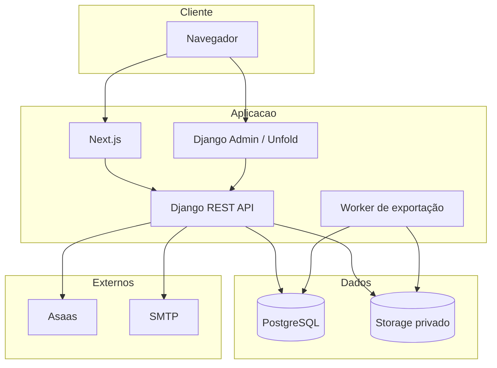

# Arquitetura geral

## Componentes

1. **Navegador:** renderiza a interface Next.js e armazena os tokens usados pela API.
2. **Frontend Next.js:** páginas públicas, autenticação, checkout e dashboard modular.
3. **API Django:** autenticação, autorização, regras de negócio, serialização e auditoria.
4. **PostgreSQL:** dados cadastrais, clínicos, financeiros, billing, jobs e auditoria.
5. **Storage:** arquivos locais no desenvolvimento ou Azure Blob configurável.
6. **Worker:** processa `ClinicalExport` e produz PDFs com WeasyPrint.
7. **Asaas:** clientes, cobranças, assinaturas e eventos de webhook.
8. **SMTP:** envio de redefinição de senha em produção.

## Estilo arquitetural

- monorepositório com frontend e backend independentes;
- API REST versionada pelo prefixo `/api/v1/`;
- módulos Django por domínio;
- frontend organizado por páginas, componentes e features;
- serviços/selectors/actions para reduzir lógica nas views;
- integrações externas encapsuladas em serviços;
- processamento assíncrono simples com fila persistida.

## Limites

- não há message broker para exportações;
- não há tenant explícito;
- o frontend e a API podem ser implantados separadamente, mas o repositório não prova uma topologia de produção;
- disponibilidade, escalabilidade e recuperação dependem da plataforma escolhida.

Implementação relacionada:

- `backend/config/settings/`
- `backend/config/urls.py`
- `frontend/src/app/`
- `docker-compose.yml`

[Voltar](README.md)
