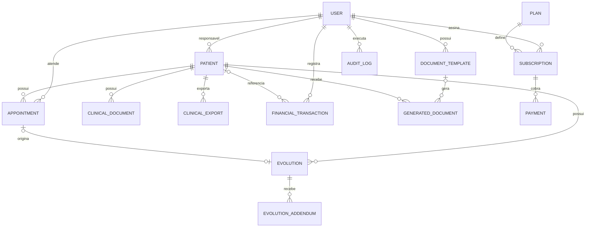

# Diagrama resumido de dados

O diagrama omite campos e entidades auxiliares para legibilidade. As migrations e models são a fonte de verdade.

[Anterior](containers.md) · [Próximo: sequências](sequencias.md) · [Voltar](../README.md)
