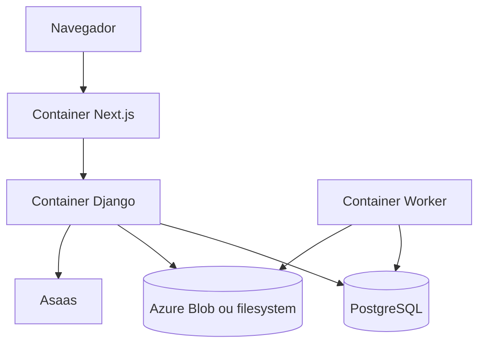

# Diagrama de containers

No Docker Compose local, frontend, backend, banco e worker são serviços separados. Redis não faz parte do compose analisado; em produção ele é configurado como cache por `REDIS_URL`.

[Anterior](contexto.md) · [Próximo: banco](banco-de-dados.md) · [Voltar](../README.md)
