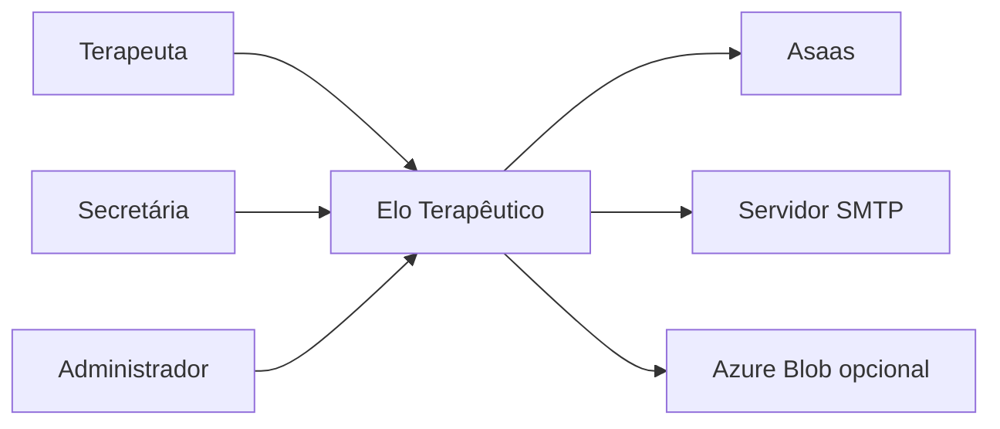

# Diagrama de contexto

- terapeuta: pacientes, agenda, prontuário, financeiro e recursos do plano;
- secretária: acesso administrativo limitado; não deve acessar prontuário clínico por padrão;
- administrador: backoffice e funções autorizadas, sem acesso automático a conteúdo confidencial;
- Asaas: processamento de billing;
- SMTP: redefinição de senha;
- Azure Blob: armazenamento privado quando configurado.

[Próximo: containers](containers.md) · [Voltar](../README.md)
