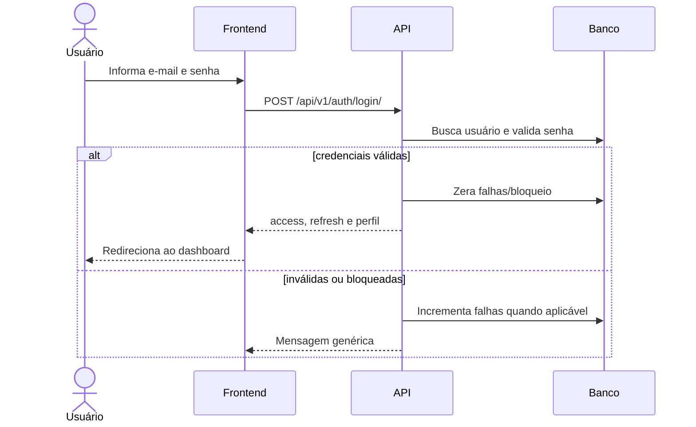
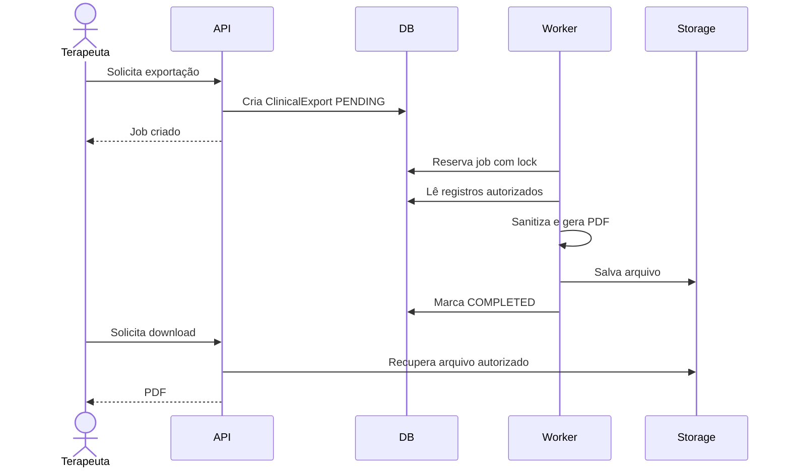
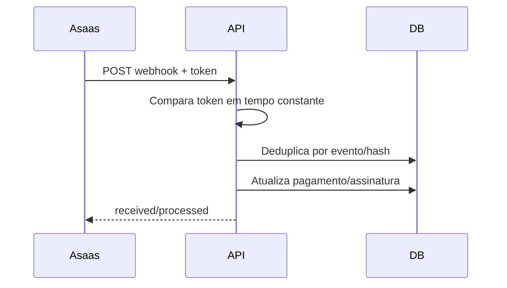

# Diagramas de sequência

## Login

```mermaid
sequenceDiagram
    actor U as Usuário
    participant F as Frontend
    participant A as API
    participant D as Banco

    U->>F: Informa e-mail e senha
    F->>A: POST /api/v1/auth/login/
    A->>D: Busca usuário e valida senha
    alt credenciais válidas
        A->>D: Zera falhas/bloqueio
        A-->>F: access, refresh e perfil
        F-->>U: Redireciona ao dashboard
    else inválidas ou bloqueadas
        A->>D: Incrementa falhas quando aplicável
        A-->>F: Mensagem genérica
    end
```

## Exportação clínica

```mermaid
sequenceDiagram
    actor T as Terapeuta
    participant API
    participant DB
    participant W as Worker
    participant S as Storage

    T->>API: Solicita exportação
    API->>DB: Cria ClinicalExport PENDING
    API-->>T: Job criado
    W->>DB: Reserva job com lock
    W->>DB: Lê registros autorizados
    W->>W: Sanitiza e gera PDF
    W->>S: Salva arquivo
    W->>DB: Marca COMPLETED
    T->>API: Solicita download
    API->>S: Recupera arquivo autorizado
    API-->>T: PDF
```

## Webhook Asaas

```mermaid
sequenceDiagram
    participant AS as Asaas
    participant API
    participant DB

    AS->>API: POST webhook + token
    API->>API: Compara token em tempo constante
    API->>DB: Deduplica por evento/hash
    API->>DB: Atualiza pagamento/assinatura
    API-->>AS: received/processed
```

[Anterior](banco-de-dados.md) · [Voltar](../README.md)
