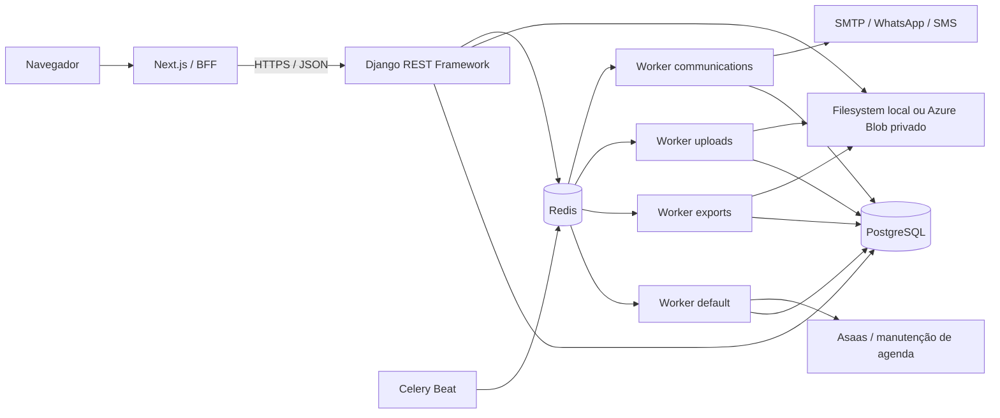
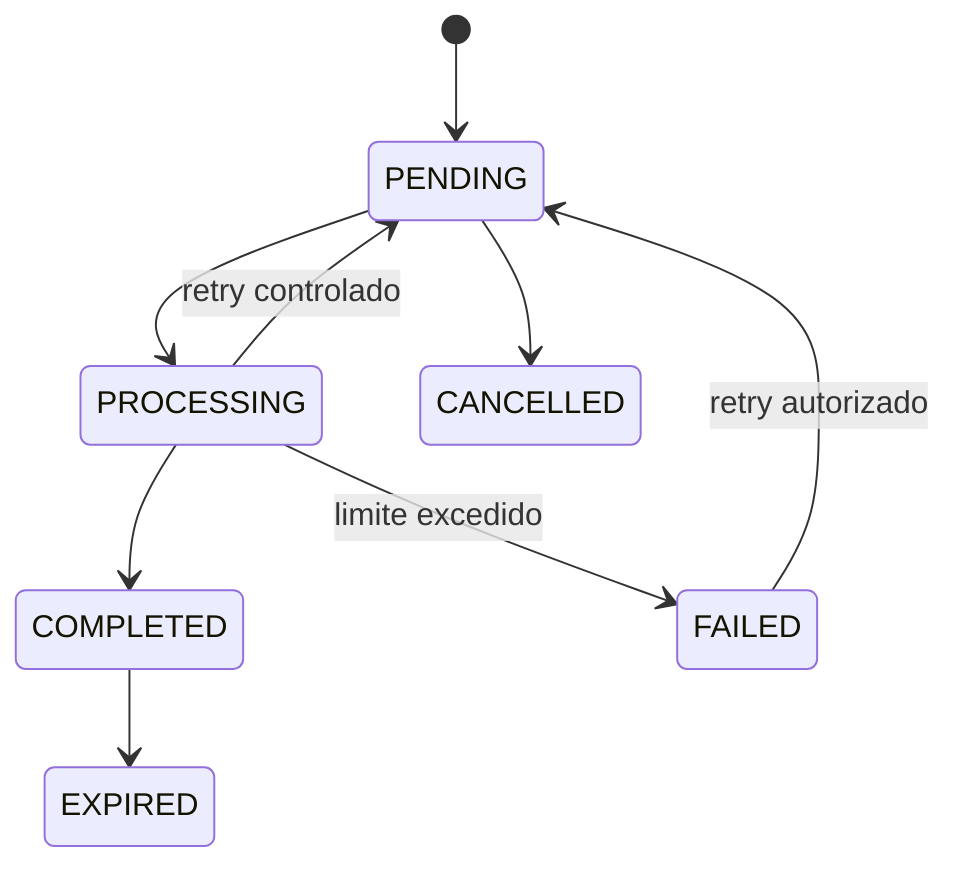

# Filas e processamento assíncrono

O PostgreSQL é a fonte oficial dos estados duráveis e da auditoria. O Redis atua como broker e backend temporário de resultados do Celery. As tasks devem receber identificadores técnicos mínimos; conteúdo clínico, credenciais, tokens e payloads completos não devem ser enviados ao broker ou registrados nos logs.

## Visão geral



## Configuração comum

A configuração fica em `backend/config/settings/celery.py` e define:

- serialização JSON;
- timezone `America/Sao_Paulo`;
- `acks_late` e rejeição de task quando o worker é perdido;
- prefetch configurável, com padrão `1`;
- visibility timeout do broker;
- soft e hard time limits;
- fila padrão `default`;
- roteamento explícito por namespace de task;
- tarefas periódicas no `CELERY_BEAT_SCHEDULE`.

O `backend/config/celery.py` inicializa a aplicação Celery, carrega settings com namespace `CELERY` e descobre tasks dos apps Django.

## Filas

| Fila | Worker no Compose | Responsabilidade principal |
| --- | --- | --- |
| `default` | `celery-worker-default` | Billing, webhooks, reconciliação, scheduling, manutenção de telemedicina e tarefas gerais |
| `exports` | `celery-worker-exports` | Geração, recuperação e expiração de exportações clínicas |
| `uploads` | `celery-worker-uploads` | Despacho, verificação, recuperação e limpeza de uploads clínicos |
| `communications` | `celery-worker-communications` | Despacho, envio, automações, notificações e limpeza de tokens de comunicação |

Cada worker é um processo independente. Celery Beat apenas publica tarefas periódicas nas filas; ele não gera PDFs, não verifica uploads e não envia mensagens diretamente.

## Roteamento de tasks

| Padrão ou task | Fila | Observação |
| --- | --- | --- |
| `apps.records.tasks.scan_clinical_document` | `uploads` | Verificação de um documento clínico |
| `apps.records.tasks.dispatch_pending_document_scans` | `uploads` | Publica scans persistidos pendentes |
| `apps.records.tasks.recover_stuck_document_scans` | `uploads` | Recupera registros presos |
| `apps.records.tasks.cleanup_rejected_clinical_documents` | `uploads` | Limpa documentos rejeitados ou em quarentena |
| `apps.records.tasks.*` | `exports` | Demais tasks do app de prontuário, incluindo exportações |
| `apps.communications.tasks.*` | `communications` | Tasks de comunicações |
| `apps.billing.tasks.*` | `default` | Webhooks, reconciliação e manutenção do billing |
| `apps.scheduling.tasks.*` | `default` | Manutenção de agenda e telemedicina |

As regras mais específicas de uploads aparecem antes do padrão amplo de `apps.records.tasks.*` para evitar roteamento incorreto.

## Worker `default`

Executa:

- despacho de webhooks de billing persistidos;
- reconciliação periódica de pagamentos Asaas;
- manutenção de salas de telemedicina expiradas;
- tasks gerais de scheduling e billing;
- outras tasks sem rota específica.

O worker não deve executar chamadas externas longas dentro de transações abertas. Webhooks devem ser persistidos de forma idempotente antes do processamento pesado.

## Worker `exports`

Fluxo resumido de exportação clínica:

1. a API valida paciente, organização e permissões;
2. cria um registro persistido em estado pendente;
3. publica uma task ou deixa o registro elegível para o dispatcher;
4. o worker reserva o registro com lock transacional;
5. gera o arquivo fora da transação longa;
6. salva no storage configurado;
7. registra hash, MIME, tamanho, progresso e expiração;
8. tarefas periódicas recuperam jobs presos e expiram arquivos antigos.



O comando legado `run_export_worker` pode permanecer por compatibilidade, mas não é o worker iniciado pelo Compose atual.

## Worker `uploads`

A fila `uploads` separa processamento de arquivos clínicos das exportações. Ela executa:

- despacho de verificações pendentes;
- verificação individual de documentos;
- recuperação de scans presos;
- limpeza de arquivos rejeitados.

A presença dessas tasks não comprova uma integração antimalware externa ativa. A documentação deve distinguir:

- validações de extensão, MIME e assinatura implementadas;
- pipeline e estados de verificação implementados;
- provedor antimalware real, quando existir;
- validação operacional em staging.

Arquivos rejeitados não devem ficar disponíveis para download normal. Logs devem usar IDs técnicos e nunca registrar o conteúdo do documento.

## Worker `communications`

O fluxo utiliza registros persistidos para comunicação, destinatários, tentativas, automações e tokens públicos. A fila processa:

- comunicações agendadas ou enfileiradas;
- tentativas e backoff;
- automações operacionais;
- notificações internas;
- e-mail via backend Django;
- WhatsApp manual;
- providers oficiais de WhatsApp ou SMS somente quando configurados;
- limpeza de tokens públicos e notificações expiradas.

Seleções concorrentes devem usar locks e `skip_locked` quando suportado. A idempotência é preservada por chaves técnicas do domínio, e falhas externas não devem expor payloads, destinos completos ou credenciais.

## Celery Beat

O serviço `celery-beat` executa um único scheduler por ambiente, salvo quando uma arquitetura de alta disponibilidade implementar coordenação própria. Duas instâncias independentes podem publicar tarefas periódicas duplicadas.

No Compose, o PID e o schedule ficam em `/tmp`, persistidos pelo volume `celery_beat_data`.

### Tarefas periódicas

| Nome no schedule | Task Celery | Frequência padrão | Fila | Finalidade |
| --- | --- | --- | --- | --- |
| `uploads-dispatch-pending` | `apps.records.tasks.dispatch_pending_document_scans` | 20 segundos | `uploads` | Publicar verificações pendentes |
| `uploads-recover-stuck` | `apps.records.tasks.recover_stuck_document_scans` | 120 segundos | `uploads` | Recuperar scans presos |
| `uploads-cleanup-quarantine` | `apps.records.tasks.cleanup_rejected_clinical_documents` | todo horário, minuto 30 | `uploads` | Limpar documentos rejeitados |
| `exports-dispatch-pending` | `apps.records.tasks.dispatch_pending_exports` | 10 segundos | `exports` | Publicar exportações pendentes |
| `exports-recover-stuck` | `apps.records.tasks.recover_stuck_exports` | 300 segundos | `exports` | Recuperar exportações presas |
| `exports-expire-files` | `apps.records.tasks.expire_clinical_exports` | a cada 15 minutos | `exports` | Expirar e remover arquivos vencidos |
| `communications-dispatch-due` | `apps.communications.tasks.dispatch_due_communications` | 20 segundos | `communications` | Despachar comunicações vencidas |
| `communications-schedule-automations` | `apps.communications.tasks.schedule_operational_automations` | 300 segundos | `communications` | Criar execuções de automações |
| `communications-cleanup-tokens` | `apps.communications.tasks.cleanup_expired_public_tokens` | diariamente às 03:15 | `communications` | Remover ou expirar tokens públicos |
| `communications-cleanup-notifications` | `apps.communications.tasks.cleanup_expired_notifications` | diariamente às 03:30 | `communications` | Limpar notificações expiradas |
| `billing-dispatch-webhooks` | `apps.billing.tasks.dispatch_pending_webhook_events` | 15 segundos | `default` | Processar webhooks persistidos |
| `billing-reconcile-payments` | `apps.billing.tasks.reconcile_asaas_payments` | 60 minutos | `default` | Reconciliar pagamentos Asaas |
| `telemedicine-expire-stale-rooms` | `apps.scheduling.tasks.expire_stale_telemedicine_rooms` | 300 segundos | `default` | Expirar salas de telemedicina abandonadas |

As frequências podem ser alteradas por variáveis de ambiente. A tabela registra os defaults do commit auditado.

## Execução local

Com Docker:

```bash
docker compose up --build
```

Sem Docker, em terminais separados:

```bash
cd backend
celery -A config worker --loglevel=INFO --queues=default --concurrency=1
celery -A config worker --loglevel=INFO --queues=exports --concurrency=1
celery -A config worker --loglevel=INFO --queues=uploads --concurrency=1
celery -A config worker --loglevel=INFO --queues=communications --concurrency=2
celery -A config beat --loglevel=INFO
```

## Desenvolvimento e produção

- no Compose local, todos os processos usam a imagem do backend com comandos diferentes;
- produção deve usar imagens imutáveis e comandos explícitos;
- PostgreSQL e Redis devem ficar em rede privada;
- Redis deve exigir autenticação e, quando oferecido pelo serviço, TLS;
- storage clínico deve ser privado e persistente;
- apenas uma instância de Beat deve estar ativa sem mecanismo de coordenação;
- workers podem ser escalados independentemente conforme profundidade e duração das filas;
- health checks de processo não substituem métricas de atraso, retries e jobs presos.

## Variáveis principais

- `REDIS_URL`, `REDIS_RESULT_URL`, `CELERY_BROKER_URL`, `CELERY_RESULT_BACKEND`;
- `CELERY_WORKER_PREFETCH_MULTIPLIER`, `CELERY_VISIBILITY_TIMEOUT_SECONDS`;
- `CELERY_RESULT_EXPIRES_SECONDS`, `CELERY_TASK_SOFT_TIME_LIMIT_SECONDS`, `CELERY_TASK_TIME_LIMIT_SECONDS`;
- `CELERY_DEFAULT_CONCURRENCY`, `CELERY_EXPORT_CONCURRENCY`, `CELERY_UPLOADS_CONCURRENCY`, `CELERY_COMMUNICATIONS_CONCURRENCY`;
- `CLINICAL_SCAN_DISPATCH_INTERVAL_SECONDS`, `CLINICAL_SCAN_RECOVERY_INTERVAL_SECONDS`;
- `EXPORT_DISPATCH_INTERVAL_SECONDS`, `EXPORT_RECOVERY_INTERVAL_SECONDS`;
- `COMMUNICATIONS_DISPATCH_INTERVAL_SECONDS`, `COMMUNICATIONS_AUTOMATION_INTERVAL_SECONDS`;
- `BILLING_WEBHOOK_DISPATCH_INTERVAL_SECONDS`, `BILLING_RECONCILIATION_INTERVAL_MINUTES`;
- `TELEMEDICINE_MAINTENANCE_INTERVAL_SECONDS`.

## Observabilidade mínima

Monitore:

- profundidade e idade das mensagens por fila;
- duração e taxa de falha das tasks;
- retries e timeouts;
- jobs persistidos presos em processamento;
- exportações falhas ou expiradas;
- uploads rejeitados e backlog de verificação;
- comunicações falhas;
- webhooks em retry ou failed;
- divergências de reconciliação;
- atraso do Beat.

Logs devem conter IDs técnicos correlacionáveis, nunca corpo clínico, tokens públicos, destinos completos ou credenciais.

[Voltar](README.md)
