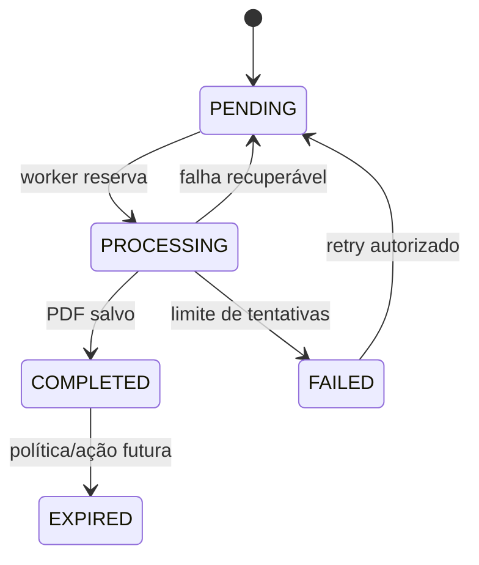

# Filas e processamento assíncrono

## Exportações clínicas

`ClinicalExport` funciona como fila persistida no banco. O management command `run_export_worker`:

1. procura jobs `PENDING` elegíveis;
2. reserva um job em transação;
3. usa `select_for_update(skip_locked=True)` fora do SQLite;
4. muda o status para `PROCESSING`;
5. gera PDF fora da transação;
6. salva o arquivo e conclui como `COMPLETED`;
7. reprograma falhas temporárias ou encerra em `FAILED` após três tentativas.

Jobs presos em processamento por mais de dez minutos são recuperados.



## Execução

```bash
cd backend
python manage.py run_export_worker
```

No Docker Compose, o serviço `worker` executa esse comando separadamente.

## Limitações

- não usa Celery, RabbitMQ ou Redis como broker;
- polling ocorre a cada dois segundos quando não há job;
- disponibilidade depende do processo worker;
- métricas e alertas de fila não estão integrados a uma plataforma externa;
- o status `EXPIRED` existe, mas a política global de expiração precisa ser documentada operacionalmente.

[Voltar](README.md)
