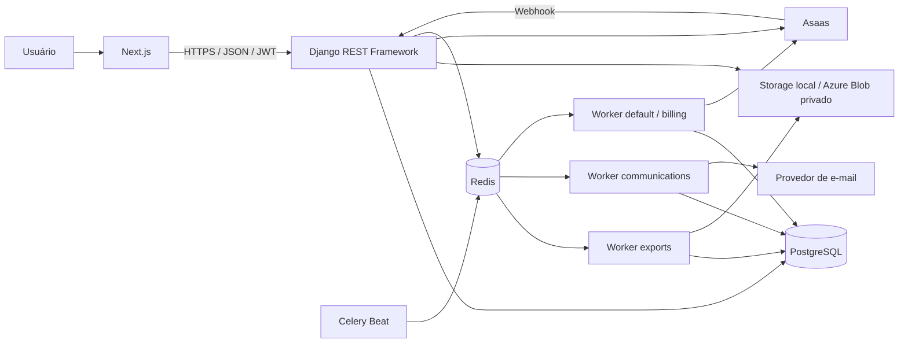
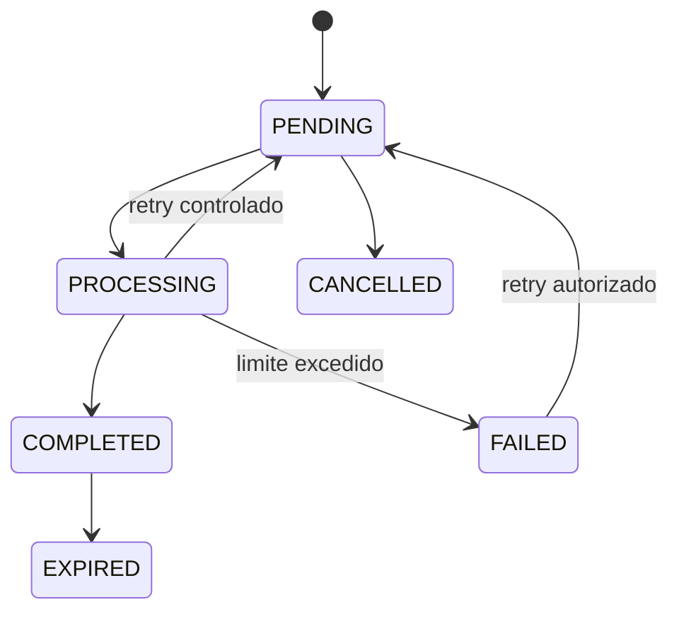

# Filas e processamento assíncrono

O PostgreSQL é a fonte oficial dos estados e da auditoria. O Redis atua apenas como broker e backend temporário do Celery. As tarefas recebem identificadores mínimos; conteúdo clínico, credenciais e payloads completos não são enviados ao Redis.



## Filas

- `exports`: geração, recuperação e expiração de exportações clínicas;
- `communications`: despacho, envio e rotinas operacionais de comunicações;
- `default`: webhooks e reconciliação de billing, além de tarefas gerais.

Cada worker é um processo independente. `Celery Beat` apenas publica tarefas periódicas; ele não envia mensagens nem gera arquivos diretamente.

## Exportações clínicas

1. A API valida paciente, usuário e permissões clínicas.
2. Cria `ClinicalExport` como `PENDING` no PostgreSQL.
3. Tenta publicar `generate_clinical_export` e responde `202 Accepted`.
4. Se o broker estiver temporariamente indisponível, o job permanece persistido e `dispatch_pending_exports` o publica depois.
5. O worker reserva o registro com lock transacional, gera o PDF fora da transação e salva pelo storage configurado.
6. São registrados hash SHA-256, tipo MIME, tamanho, progresso, task ID e expiração.
7. A rotina de expiração apaga o arquivo e mantém o registro auditável como `EXPIRED`.

Estados:



O antigo `run_export_worker` permanece apenas como compatibilidade de transição e não é iniciado pelo Docker Compose.

## Comunicações

`dispatch_due_communications` seleciona registros `SCHEDULED`/`QUEUED` vencidos com `select_for_update(skip_locked=True)`, muda para `PROCESSING` e publica um task por ID. O worker usa os providers existentes, registra cada tentativa e preserva a idempotência por proprietário e chave.

Lembretes de consulta continuam sendo criados de forma idempotente a partir das automações de 24 horas e 2 horas, respeitando reagendamento, cancelamento, timezone, preferências e janela de envio.

## Webhooks e reconciliação do Asaas

O endpoint persiste o evento idempotente e responde sem executar processamento pesado. `dispatch_pending_webhook_events` publica o ID para o worker `default`. Eventos interrompidos voltam a ser elegíveis após o timeout da reserva. `reconcile_asaas_payments` consulta periodicamente cobranças operacionais para corrigir divergências.

## Execução local

```bash
docker compose up --build
```

Comandos equivalentes:

```bash
cd backend
celery -A config worker -Q exports -l INFO --concurrency=1
celery -A config worker -Q communications -l INFO --concurrency=2
celery -A config worker -Q default -l INFO --concurrency=1
celery -A config beat -l INFO
```

Somente uma instância de Beat deve estar ativa por ambiente.

## Produção no Azure

- API, workers e Beat usam a mesma imagem, com comandos diferentes;
- PostgreSQL deve ser gerenciado e usar TLS;
- Redis deve ficar em rede privada, sem porta pública;
- Azure Blob deve usar container privado e URLs com expiração curta;
- secrets devem vir de variáveis protegidas ou Key Vault;
- `PRIVATE_MEDIA_STORAGE_REQUIRED=True` evita fallback silencioso para disco efêmero;
- `/health/live/` verifica o processo e `/health/ready/` verifica PostgreSQL e Redis; storage é opcional via `HEALTH_CHECK_STORAGE`.

## Variáveis principais

- `REDIS_URL`, `REDIS_RESULT_URL`, `CELERY_BROKER_URL`, `CELERY_RESULT_BACKEND`;
- `CELERY_WORKER_PREFETCH_MULTIPLIER`, `CELERY_VISIBILITY_TIMEOUT_SECONDS`;
- `CLINICAL_EXPORT_RETENTION_HOURS`, `CLINICAL_EXPORT_MAX_RETRIES`;
- `COMMUNICATIONS_DISPATCH_INTERVAL_SECONDS`, `COMMUNICATIONS_AUTOMATION_INTERVAL_SECONDS`;
- `BILLING_WEBHOOK_DISPATCH_INTERVAL_SECONDS`, `BILLING_RECONCILIATION_INTERVAL_MINUTES`;
- `AZURE_STORAGE_CONNECTION_STRING`, `AZURE_CONTAINER_NAME`, `PRIVATE_MEDIA_STORAGE_REQUIRED`.

## Operação

Monitore pelo menos profundidade das filas, duração, retries, jobs presos, exportações falhas, comunicações falhas e webhooks em `RETRY`/`FAILED`. Logs devem conter IDs técnicos correlacionáveis, nunca corpo clínico, tokens ou credenciais.

[Voltar](README.md)
