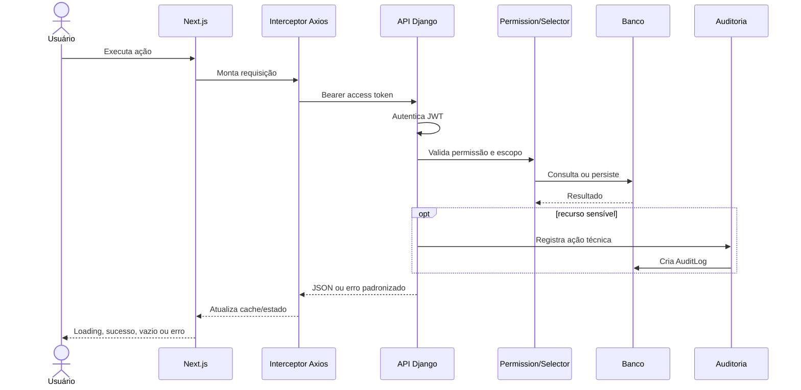

# Fluxo de requisição

## Refresh

Quando a API retorna `401`, o interceptor coordena uma única chamada a `/auth/token/refresh/`, enfileira requisições simultâneas e repete as chamadas após receber o novo access token. Se o refresh falha, limpa os cookies e redireciona para login.

## Responsabilidades

- frontend: experiência, validação preliminar e cache;
- backend: validação definitiva, autorização, integridade e auditoria;
- banco: constraints e transações;
- storage: persistência privada dos arquivos;
- infraestrutura: TLS, disponibilidade, backup e observabilidade.

[Voltar](README.md)
