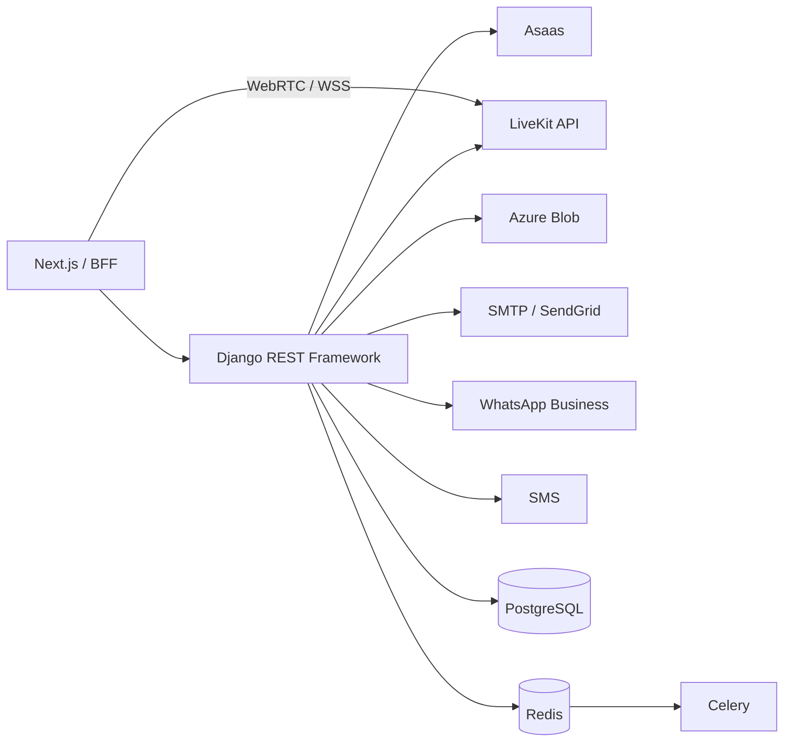

# Integrações

Uma integração é classificada em quatro níveis distintos:

1. **interface preparada:** contratos e configurações existem;
2. **implementação presente:** há client, provider ou webhook no código;
3. **configurada:** credenciais e endpoints foram fornecidos ao ambiente;
4. **validada operacionalmente:** fluxo foi testado em staging com observabilidade e tratamento de falhas.

A documentação não presume o quarto nível apenas pela presença de código.

## Visão geral

## Asaas

**Status:** 🟠 implementação presente; requer configuração e validação operacional.

Utilizado pelo domínio de Billing SaaS para:

- criação e sincronização de clientes de cobrança;
- checkout, cobranças e assinaturas;
- cancelamento e consulta de recursos;
- recebimento de webhooks;
- reconciliação periódica de pagamentos.

Configuração principal:

- `ASAAS_API_KEY`;
- `ASAAS_BASE_URL`;
- `ASAAS_WEBHOOK_TOKEN`.

Produção rejeita URL de sandbox e exige API key e token de webhook fortes. Eventos devem ser autenticados, persistidos de forma idempotente e processados pelo worker `default`. Dados clínicos não devem ser enviados ao gateway.

## LiveKit

**Status:** 🟠 implementação presente; telemedicina permanece desativada por padrão.

LiveKit fornece transporte de áudio e vídeo em tempo real. O Elo Terapêutico permanece responsável por:

- autorização;
- organização e participante;
- convite;
- consentimento;
- criação e expiração de sala;
- token de curta duração;
- chave E2EE;
- validação e idempotência do webhook;
- regras de entrada antes e depois da consulta.

Configuração:

- `TELEMEDICINE_ENABLED`;
- `TELEMEDICINE_PROVIDER`;
- `LIVEKIT_URL`;
- `LIVEKIT_API_KEY`;
- `LIVEKIT_API_SECRET`;
- parâmetros de E2EE, TTL e manutenção.

A operação exige HTTPS/WSS, webhook público protegido, staging e monitoramento de consumo. O código auditado não deve ser descrito como gravação, transcrição ou chat clínico persistente quando esses recursos não estiverem implementados.

## Azure Blob Storage

**Status:** 🟠 configurável em produção.

`config.settings.production` substitui o storage padrão por `storages.backends.azure_storage.AzureStorage` quando `AZURE_STORAGE_CONNECTION_STRING` está configurada. URLs temporárias usam `AZURE_URL_EXPIRATION_SECS` e arquivos não são sobrescritos automaticamente.

Configuração:

- `AZURE_STORAGE_CONNECTION_STRING`;
- `AZURE_CONTAINER_NAME`;
- `AZURE_URL_EXPIRATION_SECS`;
- `PRIVATE_MEDIA_STORAGE_REQUIRED`.

O repositório não comprova a existência de conta, container privado, política de retenção, identidade gerenciada ou rede implantada. Produção deve impedir fallback silencioso para disco efêmero quando mídia privada for obrigatória.

## SMTP e SendGrid

**Status:** 🟠 configurável.

Utilizado para:

- recuperação de senha;
- convites;
- comunicações operacionais;
- links temporários.

Em desenvolvimento, o backend padrão imprime mensagens no console. Em produção, settings usam SMTP/TLS, com host padrão compatível com SendGrid, mas exigem credenciais próprias.

Configuração:

- `EMAIL_BACKEND`;
- `DEFAULT_FROM_EMAIL`;
- `EMAIL_HOST`;
- `EMAIL_PORT`;
- `EMAIL_HOST_USER`;
- `EMAIL_HOST_PASSWORD`;
- `EMAIL_USE_TLS`;
- `EMAIL_TIMEOUT`.

Tokens, URLs de ação e destinatários completos não devem ser registrados em logs.

## WhatsApp manual

**Status:** ✅ implementado sem provider externo.

O módulo de Comunicações pode gerar um link `wa.me` com mensagem preenchida. A abertura do link não comprova entrega. O terapeuta deve realizar o envio e confirmar manualmente no sistema.

Esse fluxo não utiliza a API oficial e não deve ser confundido com confirmação automática de envio ou leitura.

## WhatsApp Business

**Status:** 🟡 interface preparada; provider oficial não deve ser considerado operacional sem configuração.

Configuração prevista:

- `WHATSAPP_PROVIDER`;
- `WHATSAPP_API_BASE_URL`;
- `WHATSAPP_ACCESS_TOKEN`;
- `WHATSAPP_PHONE_NUMBER_ID`;
- `WHATSAPP_WEBHOOK_VERIFY_TOKEN`;
- `WHATSAPP_APP_SECRET`.

A operação exige templates aprovados, consentimento, opt-out, validação de assinatura do webhook, confirmação de entrega e sanitização de erros. Conteúdo clínico sensível não deve ser enviado por esse canal.

## SMS

**Status:** 🟡 interface preparada; provedor não definido.

Configuração prevista:

- `SMS_PROVIDER`;
- `SMS_API_KEY`;
- `SMS_SENDER`.

A ativação depende de escolha do provedor, custo, consentimento, política de conteúdo, entrega e monitoramento.

## PostgreSQL

**Status:** ✅ persistência principal.

PostgreSQL mantém dados transacionais, estados de jobs, auditoria e idempotência. O Compose e o CI principal usam PostgreSQL 15. Produção deve utilizar acesso privado, TLS quando disponível, backups, restauração testada e monitoramento de locks e concorrência.

## Redis e Celery

**Status:** ✅ implementação presente; infraestrutura obrigatória em produção.

Redis é utilizado como:

- broker Celery;
- backend temporário de resultados;
- cache em produção;
- backend de rate limit em produção.

Celery executa exportações, uploads, comunicações, billing e manutenção de telemedicina. Redis não é a fonte durável desses domínios; estados oficiais permanecem no PostgreSQL.

## WeasyPrint

**Status:** ✅ implementado.

Gera PDFs de prontuários, recibos e documentos. Requer bibliotecas nativas Pango instaladas na imagem do backend. Fontes e recursos externos devem ser controlados para reduzir risco de SSRF e falhas de renderização.

## OpenAPI

**Status:** ✅ implementado.

`drf-spectacular` produz schema, Swagger e ReDoc. O schema deve ser validado no CI e não deve expor exemplos com dados reais, segredos ou endpoints internos desnecessários.

## GitHub Actions

**Status:** ✅ utilizado para validação do repositório.

Os workflows cobrem backend, frontend, autenticação E2E, billing, cobertura, Docker, documentação, CodeQL, Dependency Review e verificações de segurança. Eles não devem ser descritos como deploy automático quando não executarem implantação.

## Inteligência artificial

**Status:** 🔴 não implementada como integração funcional.

Há intenção comercial e placeholders, mas nenhum provedor deve ser documentado como configurado. Uma implementação futura exige governança, consentimento, isolamento entre organizações, auditoria, defesa contra prompt injection e revisão humana obrigatória.

## Regras operacionais

1. nenhuma integração configurável deve ser apresentada como operacional sem teste em staging;
2. credenciais e payloads sensíveis não podem aparecer em logs, documentação ou artefatos do CI;
3. webhooks devem usar autenticação, idempotência, auditoria e retentativas controladas;
4. timeouts e erros externos devem ser convertidos em respostas públicas sanitizadas;
5. dados clínicos não devem ser enviados a gateways de cobrança ou canais administrativos;
6. integrações desativadas devem falhar de forma segura.

Consulte também a [Matriz de integrações](../17-referencia/matriz-de-integracoes.md).

[Voltar](README.md)
