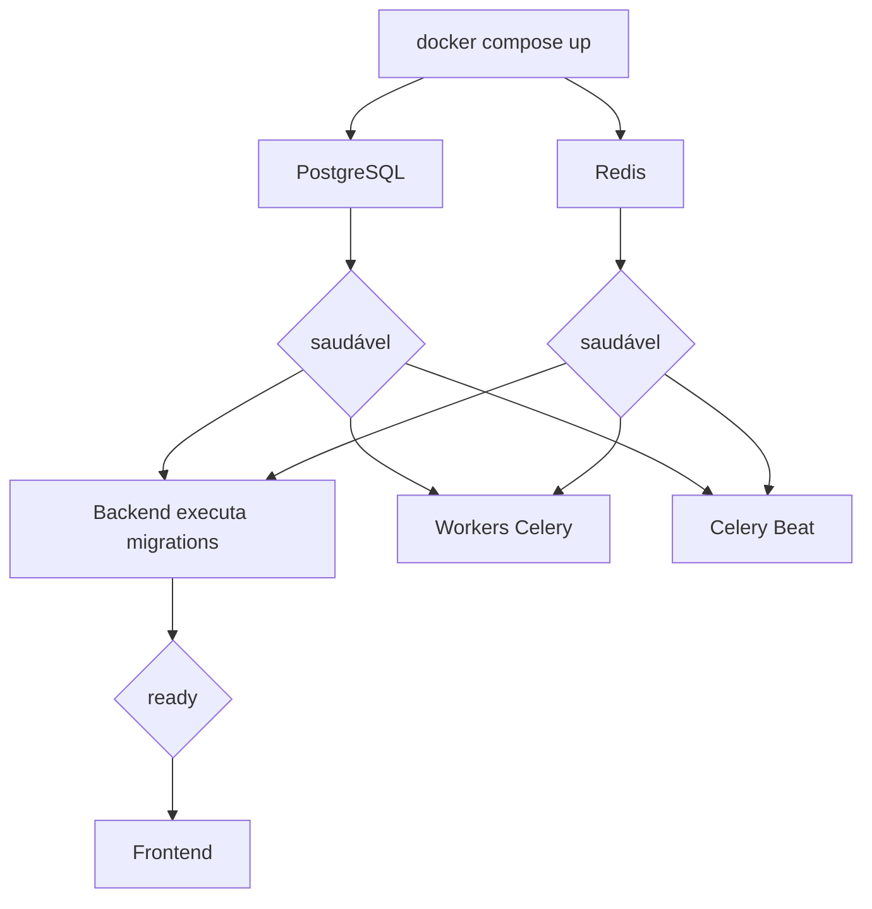

# Instalação com Docker

O `docker-compose.yml` é o caminho recomendado para primeira execução e validação local da arquitetura. Ele não representa a topologia final de produção.

## Requisitos

- Docker Engine ou Docker Desktop;
- Docker Compose v2;
- Git;
- portas locais `3000` e `8000` disponíveis;
- portas `5432` e `6379` disponíveis em loopback, caso sejam publicadas.

Verifique:

```bash
docker --version
docker compose version
```

## Preparação

Na raiz do repositório:

```bash
cp .env.example .env
```

No Windows PowerShell:

```powershell
Copy-Item .env.example .env
```

Substitua, no mínimo, os placeholders de:

```text
SECRET_KEY
JWT_SECRET
FIELD_ENCRYPTION_KEY
POSTGRES_PASSWORD
DATABASE_URL
REDIS_PASSWORD
REDIS_URL
REDIS_RESULT_URL
CELERY_BROKER_URL
CELERY_RESULT_BACKEND
ASAAS_WEBHOOK_TOKEN
```

Use valores distintos para `SECRET_KEY`, `JWT_SECRET`, `FIELD_ENCRYPTION_KEY` e `ASAAS_WEBHOOK_TOKEN`. O arquivo `.env` real não deve ser versionado.

## Validar a composição

Antes de iniciar:

```bash
docker compose config
docker compose config --services
```

A lista esperada contém:

```text
db
redis
backend
frontend
celery-worker-exports
celery-worker-uploads
celery-worker-communications
celery-worker-default
celery-beat
```

`docker compose config` expande variáveis e pode exibir valores locais no terminal. Não publique a saída quando ela contiver segredos.

## Subir o ambiente

Em primeiro plano:

```bash
docker compose up --build
```

Em segundo plano:

```bash
docker compose up --build -d
```

O fluxo é:



## Serviços

| Serviço | Função |
| --- | --- |
| `db` | PostgreSQL 15 e volume `db_data` |
| `redis` | Redis 7, AOF, broker e resultados Celery |
| `backend` | Django REST API, Admin, OpenAPI e migrations locais |
| `frontend` | Next.js, BFF e interface web |
| `celery-worker-default` | Billing, webhooks, scheduling e manutenção geral |
| `celery-worker-exports` | Exportações clínicas |
| `celery-worker-uploads` | Verificação e limpeza de uploads clínicos |
| `celery-worker-communications` | Comunicações, notificações e automações |
| `celery-beat` | Scheduler das tarefas periódicas |

Detalhes completos estão na [Matriz de containers](../17-referencia/matriz-de-containers.md).

## URLs locais

| Recurso | URL |
| --- | --- |
| Frontend | `http://localhost:3000` |
| API | `http://localhost:8000/api/v1/` |
| Swagger | `http://localhost:8000/api/docs/` |
| ReDoc | `http://localhost:8000/api/redoc/` |
| Django Admin | `http://localhost:8000/admin/` |
| Liveness | `http://localhost:8000/health/live/` |
| Readiness | `http://localhost:8000/health/ready/` |

PostgreSQL e Redis são publicados somente em `127.0.0.1` no Compose atual.

## Verificar estado

```bash
docker compose ps
```

Inspecione os serviços que não estiverem `running` ou `healthy`.

Logs principais:

```bash
docker compose logs -f backend
docker compose logs -f frontend
docker compose logs -f db
docker compose logs -f redis
```

Workers:

```bash
docker compose logs -f celery-worker-default
docker compose logs -f celery-worker-exports
docker compose logs -f celery-worker-uploads
docker compose logs -f celery-worker-communications
docker compose logs -f celery-beat
```

Não use `docker compose logs -f worker`: não existe serviço com esse nome.

## Operações no backend

Criar superusuário:

```bash
docker compose exec backend python manage.py createsuperuser
```

Django check:

```bash
docker compose exec backend python manage.py check
```

Verificar migrations pendentes:

```bash
docker compose exec backend python manage.py makemigrations --check --dry-run
```

Aplicar migrations:

```bash
docker compose exec backend python manage.py migrate
```

Executar testes:

```bash
docker compose exec backend pytest --create-db
```

Validar OpenAPI:

```bash
docker compose exec backend python manage.py spectacular --file /tmp/schema.yml --validate
```

## Reiniciar um componente

```bash
docker compose restart backend
docker compose restart frontend
docker compose restart celery-worker-communications
```

Reiniciar o processo não corrige automaticamente configuração inválida, migration quebrada, credencial ausente ou dado inconsistente.

## Rebuild

Após alterar dependências ou Dockerfiles:

```bash
docker compose build --no-cache backend frontend
docker compose up -d
```

O uso de `--no-cache` aumenta tempo e tráfego. Não é necessário para toda alteração de código porque o Compose monta os diretórios locais.

## Parar

```bash
docker compose down
```

Esse comando remove containers e rede, mas preserva volumes nomeados.

## Remover volumes

```bash
docker compose down -v
```

> **Comando destrutivo:** remove `db_data`, `redis_data`, `backend_static` e `celery_beat_data`. O banco PostgreSQL local será perdido. Use somente quando a perda for intencional.

Antes de remover dados importantes, faça backup.

## Backup local do PostgreSQL

Exemplo com dados fictícios e diretório seguro:

```bash
docker compose exec -T db pg_dump \
  -U "${POSTGRES_USER:-postgres}" \
  "${POSTGRES_DB:-config}" > backup-local.sql
```

O arquivo pode conter dados sensíveis. Não versione, não envie por canais públicos e proteja sua cópia.

Restauração deve ser testada em um banco descartável antes de uso operacional.

## Diferença entre host e rede Docker

Dentro dos containers:

```text
PostgreSQL: db:5432
Redis: redis:6379
Backend: backend:8000
```

No host:

```text
PostgreSQL: localhost:5432
Redis: localhost:6379
Backend: localhost:8000
Frontend: localhost:3000
```

Por isso, `DATABASE_URL` do Compose usa `db`, enquanto execução direta do backend usa `localhost` ou SQLite.

## Frontend e BFF

No Compose:

```text
BACKEND_API_URL=http://backend:8000/api/v1/
NEXT_PUBLIC_API_URL=http://localhost:8000/api/v1/
```

- `BACKEND_API_URL` é usada pelo servidor Next.js na rede Docker;
- `NEXT_PUBLIC_API_URL` pode chegar ao bundle e precisa ser acessível pelo navegador;
- segredos nunca podem usar prefixo `NEXT_PUBLIC_`.

## Desenvolvimento versus imagem

Os Dockerfiles possuem comandos padrão de produção:

```text
Backend: gunicorn config.wsgi:application --bind 0.0.0.0:8000
Frontend: npm run start
```

O Compose sobrescreve para:

```text
Backend: python manage.py runserver 0.0.0.0:8000
Frontend: npm run dev
```

Também monta o código como volume. Portanto:

- `runserver` não é servidor de produção;
- `next dev` não é execução de produção;
- bind mount não é imagem imutável;
- banco e Redis locais não substituem serviços protegidos;
- `.env` local não substitui secret manager;
- o Compose não prova backup, alta disponibilidade ou observabilidade.

## Produção

Antes de produção, configure:

- HTTPS e domínio;
- proxy confiável;
- Gunicorn e servidor Next.js de produção;
- PostgreSQL gerenciado ou protegido;
- Redis privado;
- Azure Blob privado para mídia;
- secrets fora do Git;
- apenas uma instância de Celery Beat sem coordenação adicional;
- workers escalados por fila;
- backup e restauração testados;
- logs centralizados, métricas e alertas;
- Asaas, LiveKit, SMTP e canais de comunicação validados em staging.

## Diagnóstico rápido

### Backend não fica healthy

```bash
docker compose logs --tail=200 backend
docker compose exec backend python manage.py check
docker compose exec backend python manage.py showmigrations
```

Verifique PostgreSQL, Redis, secrets e migrations.

### Worker não responde

```bash
docker compose logs --tail=200 celery-worker-default
docker compose exec celery-worker-default celery -A config inspect ping
```

Repita com o nome do worker afetado. Um ping bem-sucedido não comprova provider externo saudável.

### Beat parado

```bash
docker compose logs --tail=200 celery-beat
docker compose restart celery-beat
```

Confirme que não existe outra instância ativa no mesmo ambiente.

### Frontend não acessa backend

Verifique:

- `BACKEND_API_URL`;
- `NEXT_PUBLIC_API_URL`;
- health do backend;
- CORS e CSRF;
- cookies e domínio;
- rede Docker.

[Voltar](README.md)
