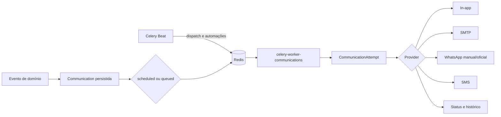

# Módulo de Comunicações

## Identificação

| Campo | Descrição |
| --- | --- |
| Backend | `backend/apps/communications/` |
| Frontend | features, páginas de notificações e configurações de integrações |
| API interna | `/api/v1/communications/` |
| API pública | `/api/v1/public/communications/` |
| Fila | `communications` |
| Worker | `celery-worker-communications` |
| Situação | 🟠 implementação ampla; canais externos dependem de configuração |

O módulo centraliza notificações internas, e-mails, WhatsApp manual, templates, automações, preferências, fila persistente, tentativas e ações públicas temporárias.

## Escopo implementado

- notificações internas com contador, dropdown e histórico;
- e-mail por meio do backend do Django;
- WhatsApp manual por link `wa.me`, com confirmação humana;
- interfaces desativadas para WhatsApp Business e SMS até configuração completa;
- templates de sistema e personalizados;
- automações operacionais;
- fila persistente no PostgreSQL e execução por Celery;
- retentativas com backoff e recuperação de registros presos;
- preferências, consentimento, opt-out e responsável legal;
- integração com Agenda, Formulários, Documentos, Financeiro e Billing;
- tokens públicos persistidos somente por hash;
- dashboard, histórico, detalhes, canais, templates e automações;
- gestão no Django Admin/Unfold.

## Arquitetura



O PostgreSQL mantém os estados oficiais. Redis transporta IDs técnicos e resultados temporários; conteúdo sensível completo não deve ser enviado ao broker.

## Entidades

| Entidade | Responsabilidade |
| --- | --- |
| `Communication` | Comunicação lógica, origem, canal, status, agendamento e idempotência |
| `CommunicationRecipient` | Destino criptografado e representação mascarada |
| `CommunicationAttempt` | Tentativa, backoff, latência e erro sanitizado |
| `CommunicationTemplate` | Template global de sistema ou personalizado |
| `CommunicationAutomation` | Configuração de automação |
| `CommunicationAutomationRun` | Auditoria de execução de automação |
| `CommunicationPreference` | Consentimento, opt-out, responsável e janela de envio |
| `InAppNotification` | Notificação exibida na aplicação |
| `InboundMessage` | Estrutura preparada para mensagens recebidas |
| `CommunicationChannelConfig` | Estado operacional dos canais |
| `PublicCommunicationActionToken` | Token temporário de uso único persistido por hash |
| `CommunicationPlanEntitlement` | Features e limites adicionais por plano |

## Isolamento por organização

Comunicações devem ser resolvidas no contexto da organização ativa e do usuário autorizado. Queries, services, signals e tasks precisam preservar:

- organização;
- autor ou responsável;
- paciente pertencente ao mesmo tenant;
- preferência do destinatário;
- entitlement do plano;
- idempotency key no escopo correto.

Filtros antigos apenas por `owner` ou `therapist` devem ser tratados como compatibilidade de migração e auditados. Uma task não pode confiar somente no ID recebido: deve recarregar o registro e validar o contexto persistido.

## Canais

### Notificação interna

**Status:** ✅ implementado.

Não depende de provedor externo. Ao processar, cria `InAppNotification` e atualiza o status da comunicação.

### E-mail

**Status:** 🟠 implementação presente; entrega real depende de SMTP.

Usa o backend de e-mail configurado no Django. Cada destinatário deve ser tratado separadamente. Prontuários, anamneses, evoluções e documentos clínicos não devem ser anexados ou incluídos no corpo administrativo.

Desenvolvimento:

```env
EMAIL_BACKEND=django.core.mail.backends.console.EmailBackend
```

Produção exige SMTP/TLS, remetente válido, credenciais protegidas e monitoramento de entrega.

### WhatsApp manual

**Status:** ✅ implementado com confirmação humana.

O sistema gera uma URL `wa.me` com mensagem preenchida. O terapeuta abre o link, envia no aplicativo e confirma manualmente no Elo Terapêutico.

A abertura do link:

- não comprova envio;
- não comprova entrega;
- não comprova leitura;
- não deve marcar automaticamente a comunicação como entregue.

### WhatsApp Business

**Status:** 🟡 interface preparada; provider oficial não comprovado como operacional.

A ativação exige provider, token, número, templates aprovados, webhook, assinatura, consentimento, opt-out e observabilidade.

### SMS

**Status:** 🟡 interface preparada; provider não definido.

Exige escolha de provedor, API key, remetente, consentimento, política de conteúdo, custo e monitoramento.

## Fila e worker

O Compose atual executa:

```bash
celery -A config worker --loglevel=INFO --queues=communications \
  --concurrency=${CELERY_COMMUNICATIONS_CONCURRENCY:-2} \
  --hostname=communications@%h
```

Serviço:

```text
celery-worker-communications
```

Health check:

```bash
celery -A config inspect ping --destination=communications@$HOSTNAME --timeout=5
```

O worker depende de PostgreSQL e Redis saudáveis. Seu health check confirma resposta do processo, mas não garante que provedores externos estejam operacionais.

## Tarefas periódicas

Celery Beat publica na fila `communications`:

| Schedule | Task | Frequência padrão | Finalidade |
| --- | --- | --- | --- |
| `communications-dispatch-due` | `apps.communications.tasks.dispatch_due_communications` | 20 segundos | Despachar comunicações vencidas |
| `communications-schedule-automations` | `apps.communications.tasks.schedule_operational_automations` | 300 segundos | Criar execuções das automações |
| `communications-cleanup-tokens` | `apps.communications.tasks.cleanup_expired_public_tokens` | diariamente às 03:15 | Expirar ou limpar tokens públicos |
| `communications-cleanup-notifications` | `apps.communications.tasks.cleanup_expired_notifications` | diariamente às 03:30 | Limpar notificações expiradas |

As frequências são configuráveis por variáveis de ambiente.

## Concorrência, reserva e recuperação

O processamento deve:

1. selecionar registros elegíveis;
2. usar transação e lock quando necessário;
3. empregar `select_for_update(skip_locked=True)` quando suportado;
4. reservar o registro por tempo limitado;
5. processar a chamada externa fora de transação longa;
6. registrar tentativa e resultado sanitizado;
7. recuperar registros presos após `COMMUNICATIONS_PROCESSING_TIMEOUT_MINUTES`;
8. respeitar `COMMUNICATIONS_MAX_ATTEMPTS`.

## Retentativas

Falhas temporárias podem usar backoff progressivo. Não devem ser repetidas indefinidamente.

Não há retentativa automática para:

- destinatário inválido;
- canal não configurado;
- opt-out;
- consentimento ausente;
- template inválido;
- limite de plano;
- erro classificado como permanente.

A documentação do backoff deve permanecer alinhada ao código; valores fixos não devem ser apresentados como contrato quando forem configuráveis.

## Eventos integrados

### Agenda

- criação e alteração de consulta;
- lembretes vencidos;
- reagendamento;
- cancelamento;
- confirmação;
- convite de telemedicina.

Reagendamento deve cancelar lembretes anteriores, revogar tokens obsoletos e criar novos registros idempotentes.

### Formulários

- atribuição de formulário;
- lembrete de prazo;
- confirmação de resposta.

Respostas clínicas não devem ser copiadas para o conteúdo de e-mail, SMS ou WhatsApp.

### Documentos

- documento disponível;
- solicitação de assinatura;
- lembrete de ação.

Downloads públicos usam token temporário, revogável e de uso controlado. O arquivo não deve ser anexado automaticamente a canais administrativos.

### Financeiro clínico

- cobrança criada;
- vencimento próximo;
- atraso;
- confirmação de pagamento;
- pacote próximo do fim.

Renderize apenas dados administrativos mínimos.

### Billing SaaS

- trial;
- assinatura;
- pagamento;
- falha ou regularização;
- restrições de entitlement.

Billing SaaS não deve incluir dados clínicos de pacientes.

## Templates

O motor aceita placeholders simples e permitidos. Não deve usar `eval`, acesso arbitrário a atributos ou execução de lógica do usuário.

Variáveis clínicas sensíveis, como diagnóstico, evolução, anamnese, medicação e conteúdo do prontuário, devem ser rejeitadas em comunicações administrativas.

Templates de sistema são imutáveis para o usuário. Personalizações devem ser criadas como cópias próprias, preservando o template original.

## Preferências, consentimento e opt-out

Antes de enfileirar um canal externo, valide:

- consentimento aplicável;
- preferência do destinatário;
- responsável legal quando necessário;
- opt-out;
- quiet hours ou janela de envio;
- canal disponível;
- entitlement e limite do plano.

Revogação de consentimento deve interromper novos envios compatíveis com a finalidade revogada, sem apagar auditoria necessária.

## API interna

Prefixo:

```text
/api/v1/communications/
```

Principais grupos:

- dashboard;
- comunicações e ações de enviar, agendar, cancelar e repetir;
- abertura e confirmação de WhatsApp manual;
- templates e preview;
- automações;
- preferências;
- notificações;
- canais;
- webhooks de provider.

Confirme os paths exatos em `backend/apps/communications/urls.py` e nos módulos de API versionada antes de publicar contratos externos.

## API pública

Prefixo:

```text
/api/v1/public/communications/
```

Ações públicas podem incluir confirmação, solicitação de cancelamento, reagendamento, envio de formulário e download temporário de documento.

Regras:

- token aleatório e temporário;
- persistência somente por hash;
- expiração e revogação;
- resposta genérica para evitar enumeração;
- rate limit;
- `Cache-Control: private, no-store` em conteúdo sensível;
- nenhuma exposição de IDs sequenciais, CPF, telefone ou e-mail na URL.

## Billing e limites

`CommunicationPlanEntitlement` pode controlar:

- acesso ao módulo;
- e-mail;
- templates personalizados;
- automações;
- WhatsApp Business;
- SMS;
- métricas;
- limites mensais;
- quantidade de templates e automações.

Perder entitlement impede novas operações não autorizadas, mas não deve apagar histórico, auditoria ou registros necessários.

## Segurança e LGPD

- conteúdo e destinos sensíveis usam criptografia em repouso quando previsto;
- e-mail e telefone são mascarados nas respostas adequadas;
- tokens públicos são persistidos por hash;
- HTML é escapado ou sanitizado;
- metadata aceita somente chaves técnicas permitidas;
- erros não armazenam payload bruto do provider;
- logs não registram conteúdo, token, credencial ou destino completo;
- ações internas são autorizadas no backend e isoladas por organização;
- auditoria não deve copiar o corpo integral da mensagem;
- o módulo não é canal de emergência.

## Variáveis principais

```text
COMMUNICATIONS_ENABLED
COMMUNICATIONS_BATCH_SIZE
COMMUNICATIONS_MAX_ATTEMPTS
COMMUNICATIONS_PROCESSING_TIMEOUT_MINUTES
COMMUNICATIONS_DEFAULT_TIMEZONE
COMMUNICATIONS_REPLY_TO
COMMUNICATIONS_DISPATCH_INTERVAL_SECONDS
COMMUNICATIONS_AUTOMATION_INTERVAL_SECONDS
COMMUNICATIONS_PAYMENT_DUE_DAYS
COMMUNICATIONS_FORM_REMINDER_HOURS
COMMUNICATIONS_DOCUMENT_REMINDER_HOURS
COMMUNICATIONS_TOKEN_RETENTION_DAYS
CELERY_COMMUNICATIONS_CONCURRENCY
```

E-mail, WhatsApp e SMS possuem grupos próprios na [referência de variáveis](../../04-configuracao/variaveis-de-ambiente.md).

## Operação

Com Docker:

```bash
docker compose logs -f celery-worker-communications
docker compose logs -f celery-beat
docker compose restart celery-worker-communications
docker compose ps
```

Sem Docker:

```bash
cd backend
celery -A config worker --loglevel=INFO --queues=communications --concurrency=2
celery -A config beat --loglevel=INFO
```

Comandos de management legados podem continuar disponíveis para diagnóstico ou compatibilidade, mas não representam os serviços atuais do Compose.

Monitore:

- backlog e idade da fila;
- comunicações presas em processamento;
- taxa de falha por canal;
- retries;
- tempo de resposta dos providers;
- tokens expirados;
- automações duplicadas;
- consumo de limite por organização.

## Testes

```bash
cd backend
pytest apps/communications/tests -q
python manage.py check
python manage.py makemigrations --check --dry-run

cd ../frontend
node --experimental-strip-types --test communications.test.mjs
npm run lint
npm run typecheck
npm run build
```

Providers reais não devem ser chamados pela suíte. Testes usam doubles, backend de e-mail controlado e dados fictícios.

## Limitações

- e-mail real depende de SMTP válido;
- WhatsApp Business depende de provider oficial, credenciais, templates e webhook;
- SMS depende da escolha de provider;
- confirmação de entrega e leitura depende do provider;
- observabilidade externa não é comprovada pelo repositório;
- quiet hours, DLQ e limites devem permanecer alinhados ao código real;
- mensagens recebidas não viram prontuário automaticamente;
- o módulo não responde por IA;
- isolamento por organização precisa ser testado de ponta a ponta.

[Voltar ao índice de módulos](../README.md)
