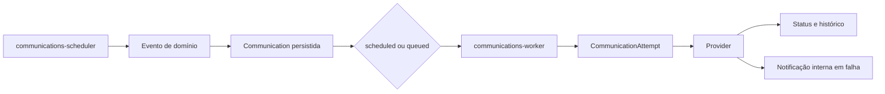

# Módulo de Comunicações

O módulo de Comunicações centraliza notificações internas, e-mails, WhatsApp manual, templates, automações, preferências de contato, fila persistente, tentativas e ações públicas seguras do Elo Terapêutico.

## Escopo implementado

- notificações internas com contador, dropdown e página de histórico;
- e-mail por meio do backend de e-mail do Django;
- WhatsApp manual por link `wa.me`, com registro da abertura e confirmação humana;
- abstrações desativadas para WhatsApp Business e SMS até existir um provedor configurado;
- templates do sistema e templates personalizados por terapeuta;
- automações operacionais criadas inicialmente desativadas;
- fila persistente no banco, sem `threading.Thread`;
- retentativas com backoff e recuperação de registros presos em processamento;
- preferências, consentimento, opt-out e responsável legal por paciente;
- integração com Agenda, Formulários, Documentos, Financeiro e Billing;
- tokens públicos armazenados somente como hash para confirmação, formulários e documentos;
- painel, histórico, detalhes, canais, templates e automações no frontend;
- gestão segura no Django Admin/Unfold.

## Arquitetura



O terapeuta autenticado é o escopo de isolamento atual. Todas as consultas internas filtram `owner` ou `therapist`; o frontend nunca escolhe o tenant.

## Models

- `Communication`: comunicação lógica, snapshots, origem, canal, status, agendamento e idempotência;
- `CommunicationRecipient`: destino criptografado e representação mascarada;
- `CommunicationAttempt`: tentativa, backoff, latência e erro sanitizado;
- `CommunicationTemplate`: template global de sistema ou personalizado;
- `CommunicationAutomation` e `CommunicationAutomationRun`: configuração e auditoria das execuções;
- `CommunicationPreference`: preferências, opt-out, consentimento, responsável e janela de envio;
- `InAppNotification`: notificações exibidas na topbar;
- `InboundMessage`: estrutura preparada para mensagens recebidas;
- `CommunicationChannelConfig`: situação operacional dos canais;
- `PublicCommunicationActionToken`: token temporário de uso único, persistido apenas por SHA-256;
- `CommunicationPlanEntitlement`: features e limites adicionais por plano.

## Canais

### Notificação interna

Funciona sem provedor externo. Ao ser processada, cria `InAppNotification` e marca a comunicação como entregue.

### E-mail

Usa `EmailMultiAlternatives` e o backend configurado no Django. Cada destinatário é enviado separadamente. Não são anexados prontuários, anamneses, evoluções ou documentos clínicos.

Em desenvolvimento:

```env
EMAIL_BACKEND=django.core.mail.backends.console.EmailBackend
```

Em produção, configure SMTP e altere o backend de e-mail conforme a infraestrutura adotada.

### WhatsApp manual

O worker gera uma URL `wa.me` com mensagem preenchida. O registro volta para `draft`, aguardando ação humana. O terapeuta deve:

1. abrir o link pelo detalhe da comunicação;
2. enviar a mensagem no WhatsApp;
3. clicar em **Confirmar envio manual**.

A abertura não significa entrega e nunca marca a mensagem como entregue automaticamente.

### WhatsApp Business e SMS

Os canais permanecem `not_configured` e inativos enquanto as variáveis necessárias não forem preenchidas e uma implementação oficial de provider não for habilitada. Nenhuma credencial é inventada e nenhum segredo é retornado pela API.

## Fila e workers

Worker principal:

```bash
python manage.py process_communications --sleep 5
```

Execução de um único lote:

```bash
python manage.py process_communications --once --batch-size 50
```

O processamento usa `select_for_update(skip_locked=True)` quando suportado pelo banco. Registros presos em `processing` por mais de `COMMUNICATIONS_PROCESSING_TIMEOUT_MINUTES` voltam para a fila.

Scheduler operacional:

```bash
python manage.py schedule_communication_automations
python manage.py retry_failed_communications
python manage.py cleanup_expired_communication_tokens
```

No Docker Compose existem os serviços `communications-worker` e `communications-scheduler`.

## Política de retentativas

Falhas temporárias usam o seguinte backoff:

1. 1 minuto;
2. 5 minutos;
3. 30 minutos;
4. 2 horas;
5. falha permanente.

Não há retentativa para destinatário inválido, canal sem configuração, opt-out, template inválido, limite de plano ou erro permanente.

## Eventos integrados

### Agenda

- `appointment.created`;
- `appointment.reminder_due`;
- `appointment.rescheduled`;
- `appointment.canceled`;
- `appointment.confirmed`.

Reagendamento cancela lembretes anteriores, revoga tokens e cria novos registros idempotentes. Cancelamento interrompe lembretes futuros.

### Formulários

- `form.assigned` gera link individual;
- `form.due_soon` é produzido pelo scheduler;
- formulário respondido invalida o token, cancela lembretes e cria notificação interna.

As respostas não são enviadas por e-mail e não entram no conteúdo da comunicação.

### Documentos

- `document.available` gera aviso com link temporário;
- `document.signature_requested` pode ser agendado pelo scheduler;
- assinatura cancela avisos pendentes.

O PDF é baixado por endpoint protegido pelo token de uso único, com `Cache-Control: private, no-store`.

### Financeiro

- `financial.payment_created`;
- `financial.payment_due_soon`;
- `financial.payment_overdue`;
- `financial.payment_confirmed`;
- `financial.package_ending`.

Somente valores e datas administrativos mínimos são renderizados. Pagamento confirmado ou cobrança cancelada cancela avisos futuros.

## Templates e variáveis

O motor aceita somente placeholders simples, sem `eval`, acesso a atributos ou lógica arbitrária. O catálogo permitido fica em `apps/communications/constants.py` e `validators.py`.

Variáveis clínicas, como diagnóstico, evolução, anamnese, medicação e conteúdo de prontuário, são rejeitadas.

Templates de sistema são criados por migration idempotente. Um terapeuta não pode editá-los; ao personalizar, deve duplicar o template.

## API

Prefixo interno:

```text
/api/v1/communications/
```

Principais rotas:

```text
GET    communications/dashboard/
GET    communications/
POST   communications/
GET    communications/{public_id}/
PATCH  communications/{public_id}/
DELETE communications/{public_id}/
POST   communications/{public_id}/send/
POST   communications/{public_id}/schedule/
POST   communications/{public_id}/cancel/
POST   communications/{public_id}/retry/
POST   communications/{public_id}/open-manual/
POST   communications/{public_id}/mark-manually-sent/
GET    communications/templates/
POST   communications/templates/preview/
GET    communications/automations/
GET    communications/preferences/
GET    communications/notifications/
GET    communications/channels/
POST   communications/webhooks/{provider}/
```

Ações públicas:

```text
GET  /api/v1/public/communications/actions/{token}/
POST /api/v1/public/communications/actions/{token}/confirm/
POST /api/v1/public/communications/actions/{token}/cancel-request/
POST /api/v1/public/communications/actions/{token}/reschedule-request/
POST /api/v1/public/communications/actions/{token}/form-submit/
GET  /api/v1/public/communications/actions/{token}/document-download/
```

As respostas públicas são genéricas e não revelam se um paciente existe.

## Billing

`CommunicationPlanEntitlement` estende o plano sem modificar o histórico do Billing. Ele controla:

- acesso ao módulo;
- e-mail;
- templates personalizados;
- automações;
- WhatsApp Business;
- SMS;
- métricas;
- limite mensal total e de e-mail;
- quantidade de automações e templates.

A perda da feature impede novos envios externos, mas não apaga comunicações, templates ou automações. Preview e `dry-run` não entram no consumo.

## Segurança e LGPD

- conteúdo e destinos usam a infraestrutura de campos criptografados;
- telefone e e-mail são mascarados nas respostas de listagem;
- tokens públicos são aleatórios, temporários, revogáveis e armazenados somente por hash;
- IDs sequenciais, CPF, telefone e e-mail não entram nas URLs públicas;
- HTML é escapado antes de ser apresentado;
- metadata aceita somente chaves técnicas explicitamente permitidas;
- erros e logs não persistem payload bruto, segredos ou destinos completos;
- todas as ações internas são isoladas pelo terapeuta;
- ações sensíveis usam a auditoria existente sem gravar o corpo completo;
- o sistema não é apresentado como canal de emergência.

## Variáveis de ambiente

```env
COMMUNICATIONS_ENABLED=True
COMMUNICATIONS_BATCH_SIZE=50
COMMUNICATIONS_MAX_ATTEMPTS=5
COMMUNICATIONS_PROCESSING_TIMEOUT_MINUTES=15
COMMUNICATIONS_DEFAULT_TIMEZONE=America/Sao_Paulo
COMMUNICATIONS_REPLY_TO=

EMAIL_BACKEND=django.core.mail.backends.console.EmailBackend
DEFAULT_FROM_EMAIL=noreply@example.test
EMAIL_HOST=
EMAIL_PORT=587
EMAIL_HOST_USER=
EMAIL_HOST_PASSWORD=
EMAIL_USE_TLS=True
EMAIL_TIMEOUT=15

WHATSAPP_PROVIDER=
WHATSAPP_API_BASE_URL=
WHATSAPP_ACCESS_TOKEN=
WHATSAPP_PHONE_NUMBER_ID=
WHATSAPP_WEBHOOK_VERIFY_TOKEN=
WHATSAPP_APP_SECRET=

SMS_PROVIDER=
SMS_API_KEY=
SMS_SENDER=
```

Não versione valores reais.

## Operação e diagnóstico

```bash
python manage.py process_communications --once
python manage.py schedule_communication_automations
python manage.py retry_failed_communications
python manage.py cleanup_expired_communication_tokens
```

No admin, consulte Comunicações, Tentativas e Execuções de automação. Erros exibidos são sanitizados; stack traces e payloads de provedor não são armazenados nesses models.

## Testes

```bash
cd backend
pytest apps/communications/tests -q
python manage.py check
python manage.py makemigrations --check --dry-run

cd ../frontend
node --experimental-strip-types --test communications.test.mjs
npm run lint
npm run typecheck
npm run build
```

Providers reais nunca são chamados pela suíte. O backend de e-mail dos testes é `locmem`.

## Limitações dependentes de configuração externa

- e-mail real depende de SMTP válido;
- WhatsApp Business depende da escolha do provedor, credenciais oficiais e validação oficial do webhook;
- SMS depende da escolha do provedor;
- confirmação de entrega e leitura externa depende do provider configurado;
- o módulo não responde automaticamente por IA e mensagens recebidas não viram prontuário sem revisão humana.
