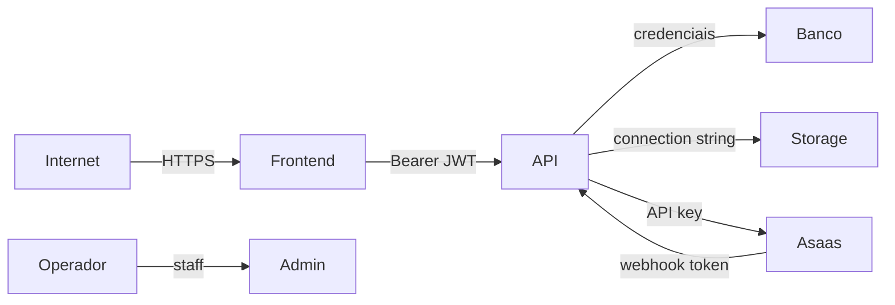

# Modelo de ameaças

## Ativos

- credenciais e tokens;
- dados cadastrais e de contato;
- prontuários, anamneses, evoluções e anexos;
- documentos gerados e exportações;
- agenda e telemedicina;
- valores financeiros e billing;
- logs de auditoria;
- chaves de criptografia, banco, SMTP, Azure e Asaas.

## Fronteiras de confiança

## Ameaças prioritárias

| Ameaça | Vetor | Controles atuais | Lacuna |
| --- | --- | --- | --- |
| Sequestro de sessão | XSS rouba cookies JWT | sanitização clínica, CSP parcial não comprovada | tokens client-readable |
| IDOR/acesso cruzado | alterar IDs em rotas | selectors, querysets, permissions | revisão integral por endpoint |
| Vazamento clínico | logs, exports, storage | criptografia, auditoria mínima, filtros | storage/backup operacionais |
| Elevação de privilégio | role/staff/grupos | role readonly, permissões Django | governança e revisão periódica |
| Upload malicioso | arquivo disfarçado | limite, MIME, magic bytes | antivírus ausente |
| Webhook falso/replay | endpoint público | token, compare_digest, dedupe | dev aceita sem token |
| Compromisso de segredo | `.env`, log ou CI | `.gitignore`, validação de força | secret manager/rotação |
| Corrupção/ransomware | banco/storage | constraints, snapshots | backup imutável/restauração |
| Mistura entre clínicas | ausência de tenant | vínculo por terapeuta | tenant explícito ausente |
| Abuso de admin | staff excessivo | permissions, testes confidenciais | MFA/rede/auditoria externa |

## Hipóteses

- o ambiente usa TLS válido;
- banco e storage não são públicos;
- segredos não são compartilhados entre finalidades;
- processos operacionais respeitam menor privilégio;
- usuários não compartilham contas.

Se uma hipótese não for verdadeira, o risco precisa ser reavaliado.

[Voltar](README.md)
