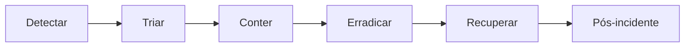

# Resposta a incidentes

## Preparação

- responsáveis e contatos definidos;
- inventário de dados, serviços e segredos;
- logs centralizados e relógios sincronizados;
- backups protegidos e testados;
- procedimento de revogação de tokens e credenciais;
- canais de comunicação fora do ambiente afetado;
- avaliação jurídica e de privacidade previamente contratada.

## Fluxo

## Ações por cenário

### Token/JWT exposto

- rotacionar JWT secret quando necessário;
- revogar refresh tokens e forçar novo login;
- corrigir vetor XSS/log;
- analisar acessos por usuário/objeto.

### Chave de criptografia exposta

- conter acesso ao banco e backups;
- introduzir chave V2;
- recriptografar dados de forma controlada;
- avaliar comprometimento histórico.

### Asaas/Azure/SMTP exposto

- revogar no provedor;
- criar credencial distinta;
- atualizar secret manager;
- revisar eventos e acessos;
- testar integração após rotação.

### Vazamento clínico

- preservar evidências sem replicar conteúdo;
- identificar titulares, campos, intervalo e destinatários;
- bloquear exports/links afetados;
- envolver responsável de privacidade e jurídico;
- cumprir obrigações de comunicação aplicáveis.

## Pós-incidente

Registrar linha do tempo, causa raiz, impacto, ações, testes, responsáveis e prazo. Não incluir dados clínicos desnecessários no relatório.

[Voltar](README.md)
