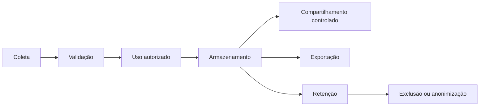

# Ciclo de vida dos dados

## Coleta

Formulários de conta, paciente, prontuário, agenda, financeiro, documentos e billing. Coletar apenas campos necessários e informar finalidade.

## Validação

Serializers, validators, constraints, sanitização de conteúdo e uploads. Validação técnica não comprova exatidão clínica.

## Uso

Roles, selectors e permissions limitam acesso. Conteúdo confidencial possui regra adicional. A organização deve definir necessidade de acesso e supervisão.

## Armazenamento

Banco, storage e backups. Campos clínicos selecionados são cifrados; infraestrutura também deve usar criptografia, IAM, rede e logs.

## Compartilhamento

Asaas, SMTP e nuvem recebem dados conforme integração. Contratos, finalidade e transferências precisam ser avaliados.

## Exportação

CSV de pacientes, relatórios, PDFs clínicos e documentos. Exportações aumentam risco e precisam de autorização, auditoria, expiração e canal seguro.

## Retenção

Não há política única automática comprovada. Arquivamento lógico preserva dados e não equivale a eliminação.

## Descarte

Deve considerar vínculos protegidos, obrigações profissionais, backups e auditoria. Ação precisa ser verificável e aprovada.

[Voltar](README.md)
