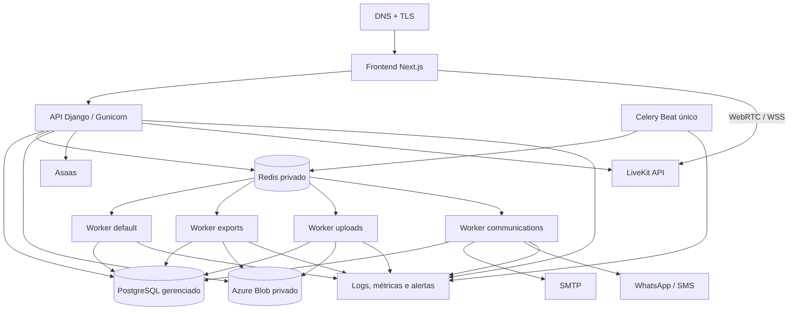

# Arquitetura de produção

O repositório contém settings e imagens compatíveis com uma implantação em containers ou App Service, mas não comprova que um ambiente esteja implantado.

## Topologia suportada

## Componentes

### Frontend

- build imutável do Next.js;
- `next start` ou plataforma compatível;
- HTTPS;
- BFF com cookies HttpOnly e CSRF;
- acesso server-side ao backend por rede privada ou endpoint protegido;
- LiveKit por WSS no navegador.

### Backend

- `DJANGO_SETTINGS_MODULE=config.settings.production`;
- Gunicorn como servidor WSGI da imagem;
- migrations por job controlado;
- health checks de liveness e readiness;
- WhiteNoise para estáticos quando aplicável;
- logs estruturados em JSON;
- autenticação tenant-aware;
- acesso privado a PostgreSQL, Redis e Blob.

Migrations não devem ser executadas simultaneamente por todas as réplicas da API.

### Workers

A mesma imagem do backend pode ser utilizada com comandos distintos:

- worker `default` para Billing, webhooks, scheduling e manutenção;
- worker `exports` para exportações clínicas;
- worker `uploads` para verificação de arquivos;
- worker `communications` para mensagens e automações;
- Celery Beat para tarefas periódicas.

Cada fila pode escalar de forma independente. Escala não substitui idempotência, locks, timeouts e recuperação de jobs.

### Celery Beat

Sem coordenação específica, mantenha uma única instância. Múltiplas instâncias podem publicar tarefas duplicadas.

### PostgreSQL

- serviço gerenciado ou protegido;
- TLS quando disponível;
- backup e point-in-time restore conforme plano;
- restauração testada;
- monitoramento de conexões, locks e armazenamento;
- migrations controladas.

### Redis

- rede privada;
- autenticação;
- TLS quando disponível;
- sem porta pública;
- monitoramento de memória, conexões, backlog e evictions;
- broker, result backend, cache e rate limit.

### Azure Blob

- container privado;
- URLs temporárias curtas;
- `PRIVATE_MEDIA_STORAGE_REQUIRED=True`;
- retenção e descarte;
- backup ou estratégia de recuperação;
- acesso por connection string no código auditado.

Identidade gerenciada só deve ser documentada como implementada após suporte explícito no código e infraestrutura.

## Opções Azure

A escolha depende de custo, escala e capacidade operacional:

- **Azure App Service:** adequado para frontend/API, com processos separados para workers quando suportados e operáveis;
- **Azure Container Apps:** adequado para API, workers e Beat como revisões/serviços independentes;
- **Azure Database for PostgreSQL:** persistência gerenciada;
- **serviço Redis compatível:** broker/cache privado conforme disponibilidade da assinatura;
- **Azure Blob Storage:** mídia privada;
- **Azure Monitor/Application Insights:** logs, métricas e alertas;
- **Key Vault:** secrets e rotação.

Essas opções são arquitetura suportada ou recomendada, não prova de implantação.

## Rede e segurança

- HTTPS e WSS obrigatórios;
- banco, Redis e storage não expostos publicamente;
- secrets em Key Vault ou configuração protegida;
- CORS e CSRF explícitos;
- proxy confiável configurado;
- HSTS e headers de segurança;
- rate limit;
- egress controlado quando possível;
- webhooks autenticados;
- logs sem dados clínicos ou credenciais.

## Multi-tenancy

Organização, membership e autenticação tenant-aware existem. Antes de produção clínica, ainda é necessário comprovar:

- ownership por organização em todos os apps;
- relações cruzadas rejeitadas;
- tasks Celery no tenant correto;
- cache com tenant na chave;
- relatórios e exportações isolados;
- webhooks resolvidos no tenant correto;
- troca de organização sem reaproveitar cache;
- Admin com least privilege.

## Observabilidade mínima

- disponibilidade e latência da API/BFF;
- erros 4xx/5xx por rota;
- conexões e locks do PostgreSQL;
- memória e backlog do Redis;
- profundidade e idade por fila;
- retries, timeouts e jobs presos;
- falhas de storage;
- webhooks e reconciliação;
- falhas de comunicação;
- salas LiveKit expiradas;
- atraso do Beat;
- uso e custo das integrações.

## Backup e rollback

Defina:

- RPO e RTO;
- backup PostgreSQL;
- recuperação de Blob;
- retenção de logs;
- teste de restauração;
- rollback de imagem;
- estratégia de migration compatível;
- plano para rotacionar secrets;
- comunicação de incidente.

Rollback de código não desfaz migration destrutiva automaticamente.

## Bloqueadores antes de dados clínicos reais

- storage privado persistente;
- backup e restauração testados;
- monitoramento, alertas e runbooks;
- revisão transversal de tenant;
- permissões do Admin;
- provedores externos validados em staging;
- política de retenção e descarte;
- testes de concorrência e segurança;
- avaliação jurídica e LGPD;
- plano de incidentes.

[Voltar](README.md)
