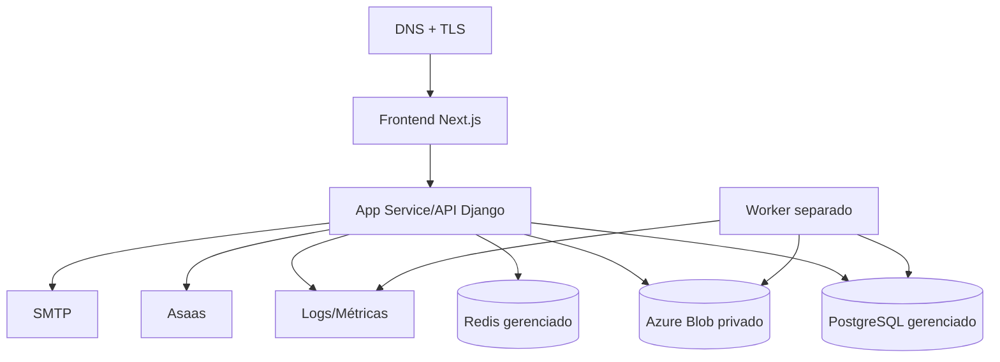

# Arquitetura de produção

## Topologia recomendada

## Requisitos

- frontend e backend podem ser implantados separadamente;
- backend usa settings `prod` e Gunicorn;
- worker precisa de processo/serviço contínuo separado;
- migrations executadas por job controlado, não por todas as réplicas simultaneamente;
- banco e storage não expostos à internet;
- Redis disponível para cache/rate limit;
- arquivos estáticos servidos por WhiteNoise ou CDN;
- health checks monitorados;
- segredos em Key Vault/configuração protegida;
- backups e restore point objetivos definidos.

## Escalabilidade

API é stateless quanto à sessão JWT, mas arquivos locais e worker exigem atenção. Múltiplos workers são suportados pelo `skip_locked` em PostgreSQL. SQLite não serve para essa concorrência.

## Bloqueadores

Tenant/clínica, tokens client-readable, storage obrigatório, backup e autorização precisam estar resolvidos antes de produção clínica.

[Voltar](README.md)
