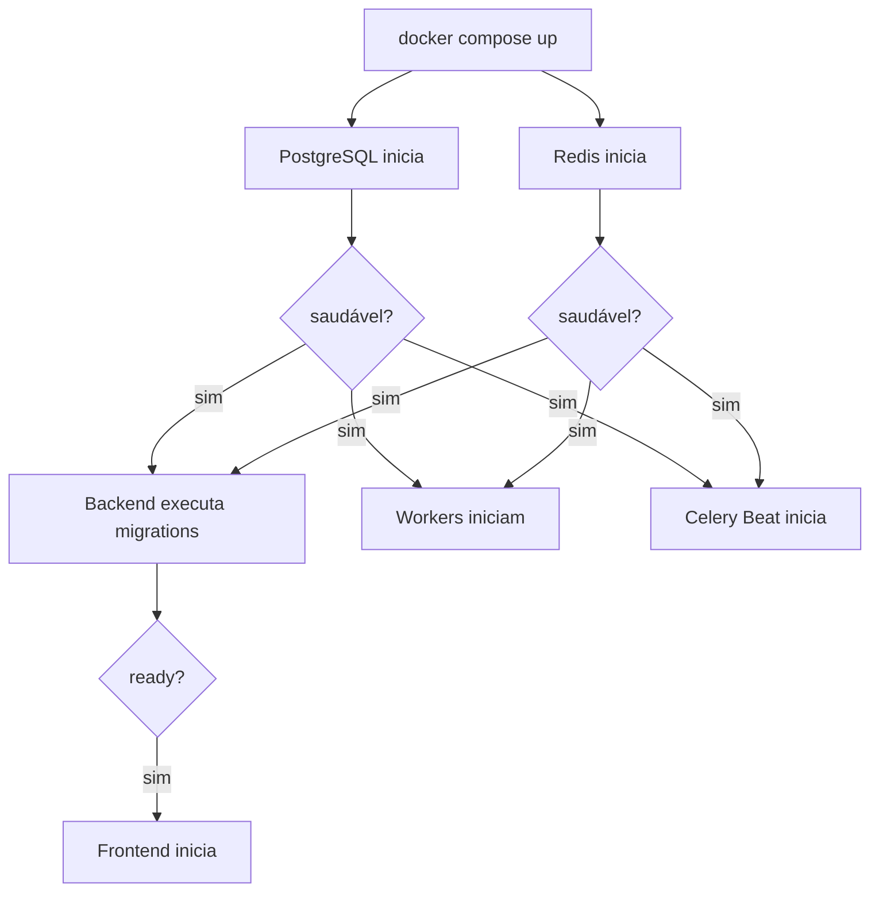
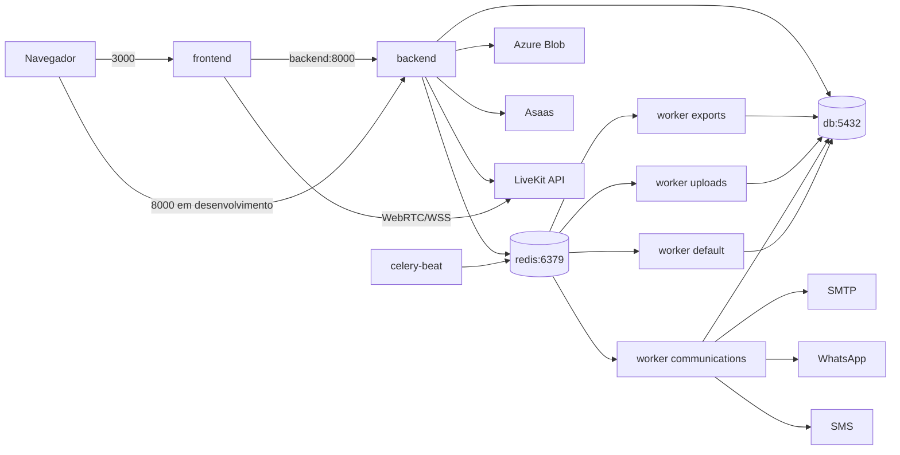

# Matriz de containers

Esta referência descreve o `docker-compose.yml` do commit auditado. O Compose é destinado ao desenvolvimento local e à validação da arquitetura; não representa, sozinho, a topologia final de produção.

## Serviços

| Serviço | Responsabilidade | Imagem ou build | Comando no Compose | Porta publicada | Dependências | Health check | Volumes |
| --- | --- | --- | --- | --- | --- | --- | --- |
| `db` | Persistência PostgreSQL | `postgres:15-alpine` | comando padrão da imagem | `127.0.0.1:5432:5432` | nenhuma | `pg_isready` | `db_data` |
| `redis` | Broker, resultados Celery e persistência AOF | `redis:7-alpine` | `redis-server --appendonly yes --requirepass ...` | `127.0.0.1:6379:6379` | nenhuma | `redis-cli ... ping` | `redis_data` |
| `backend` | API Django, Admin, OpenAPI, migrations e health checks | build `./backend/Dockerfile` | migrations + `runserver 0.0.0.0:8000` | `8000:8000` | `db` e `redis` saudáveis | `GET /health/ready/` | código e `backend_static` |
| `frontend` | Next.js, BFF e interface | build `./frontend/Dockerfile` | `npm run dev` | `3000:3000` | `backend` saudável | não definido no Compose | código, `node_modules` e `.next` anônimos |
| `celery-worker-exports` | Exportações clínicas | build do backend | worker na fila `exports` | nenhuma | `db` e `redis` saudáveis | `celery inspect ping` | código do backend |
| `celery-worker-uploads` | Verificação e limpeza de uploads clínicos | build do backend | worker na fila `uploads` | nenhuma | `db` e `redis` saudáveis | `celery inspect ping` | código do backend |
| `celery-worker-communications` | Comunicações, automações e notificações | build do backend | worker na fila `communications` | nenhuma | `db` e `redis` saudáveis | `celery inspect ping` | código do backend |
| `celery-worker-default` | Billing, webhooks, scheduling e manutenção geral | build do backend | worker na fila `default` | nenhuma | `db` e `redis` saudáveis | `celery inspect ping` | código do backend |
| `celery-beat` | Scheduler das tarefas periódicas | build do backend | `celery -A config beat` | nenhuma | `db` e `redis` saudáveis | PID ativo | código e `celery_beat_data` |

## Fluxo de inicialização



`depends_on` controla a ordem baseada em health checks, mas não substitui retry interno, observabilidade ou tratamento de indisponibilidade após a inicialização.

## Comunicação



## Detalhamento

### `db`

- usa PostgreSQL 15 Alpine;
- persiste dados em `db_data`;
- recebe usuário, senha e banco por `.env`;
- publica a porta apenas em loopback;
- containers acessam pelo hostname `db`;
- processos no host acessam por `localhost:5432`;
- `docker compose down -v` remove o volume e destrói os dados locais.

Produção deve usar backup, restauração testada, acesso privado, TLS quando disponível, monitoramento e política de atualização.

### `redis`

- usa Redis 7 Alpine;
- exige senha;
- habilita AOF;
- persiste em `redis_data`;
- banco lógico `/0` é usado pelo broker/cache conforme configuração;
- banco lógico `/1` é usado pelo result backend padrão;
- containers acessam pelo hostname `redis`;
- a porta publicada em loopback é apenas para desenvolvimento.

Perder Redis pode interromper cache, rate limit, publicação e execução de tasks. Estados oficiais dos jobs devem continuar persistidos no PostgreSQL.

### `backend`

A imagem usa Python 3.12 Slim, instala dependências nativas do PostgreSQL e Pango, copia requirements e possui Gunicorn como `CMD` padrão.

O Compose sobrescreve o comando para:

```bash
python manage.py migrate --noinput &&
python manage.py runserver 0.0.0.0:8000
```

Consequências:

- migrations são executadas ao iniciar o ambiente local;
- `runserver` é adequado apenas ao desenvolvimento;
- o volume `./backend:/app` habilita edição local;
- a imagem montada não é imutável;
- `backend_static` preserva `staticfiles` no ambiente local;
- o health check usa `/health/ready/`.

URLs locais:

- API: `/api/v1/`;
- Admin: `/admin/`;
- Swagger: `/api/docs/`;
- ReDoc: `/api/redoc/`;
- liveness: `/health/live/`;
- readiness: `/health/ready/`.

### `frontend`

A imagem usa Node.js 24 Alpine, executa `npm ci`, copia o código, faz `npm run build` e possui `npm run start` como comando padrão.

O Compose sobrescreve o comando para:

```bash
npm run dev
```

Variáveis:

- `BACKEND_API_URL=http://backend:8000/api/v1/` é usada pelo servidor Next.js dentro da rede Docker;
- `NEXT_PUBLIC_API_URL=http://localhost:8000/api/v1/` é pública e acessível pelo navegador;
- `LIVEKIT_URL` participa da configuração de telemedicina.

Volumes anônimos protegem `node_modules` e `.next` do conteúdo montado do host. `next dev` e hot reload não representam produção.

### `celery-worker-default`

Comando:

```bash
celery -A config worker --loglevel=INFO --queues=default \
  --concurrency=${CELERY_DEFAULT_CONCURRENCY:-1} \
  --hostname=default@%h
```

Processa principalmente:

- webhooks de billing;
- reconciliação Asaas;
- manutenção de telemedicina;
- tasks de scheduling;
- tasks gerais sem rota específica.

### `celery-worker-exports`

Comando:

```bash
celery -A config worker --loglevel=INFO --queues=exports \
  --concurrency=${CELERY_EXPORT_CONCURRENCY:-1} \
  --hostname=exports@%h
```

Processa exportações clínicas, recuperação de jobs e expiração de arquivos. Possui `stop_grace_period` maior para permitir encerramento controlado.

### `celery-worker-uploads`

Comando:

```bash
celery -A config worker --loglevel=INFO --queues=uploads \
  --concurrency=${CELERY_UPLOADS_CONCURRENCY:-1} \
  --hostname=uploads@%h
```

Processa scans persistidos, recuperação de jobs e limpeza de documentos rejeitados. O pipeline não comprova provider antimalware externo ativo.

### `celery-worker-communications`

Comando:

```bash
celery -A config worker --loglevel=INFO --queues=communications \
  --concurrency=${CELERY_COMMUNICATIONS_CONCURRENCY:-2} \
  --hostname=communications@%h
```

Processa comunicações, tentativas, automações, notificações e providers configurados.

### `celery-beat`

Comando:

```bash
celery -A config beat --loglevel=INFO \
  --pidfile=/tmp/celerybeat.pid \
  --schedule=/tmp/celerybeat-schedule
```

O volume `celery_beat_data` mantém PID e schedule. Sem coordenação específica, mantenha apenas uma instância por ambiente para evitar publicação duplicada.

## Volumes

| Volume | Montagem | Conteúdo | Consequência da remoção |
| --- | --- | --- | --- |
| `db_data` | `/var/lib/postgresql/data` | banco local | perda total dos dados PostgreSQL locais |
| `redis_data` | `/data` | AOF e dados Redis locais | perda de cache, resultados e mensagens ainda não processadas |
| `backend_static` | `/app/staticfiles` | arquivos coletados/gerados | estáticos precisam ser recriados |
| `celery_beat_data` | `/tmp` | PID e schedule do Beat | schedule local é recriado; investigar duplicidade após reinício |

## Comandos operacionais

```bash
docker compose config
docker compose config --services
docker compose ps
```

Logs:

```bash
docker compose logs -f backend
docker compose logs -f frontend
docker compose logs -f db
docker compose logs -f redis
docker compose logs -f celery-worker-default
docker compose logs -f celery-worker-exports
docker compose logs -f celery-worker-uploads
docker compose logs -f celery-worker-communications
docker compose logs -f celery-beat
```

Backend:

```bash
docker compose exec backend python manage.py check
docker compose exec backend python manage.py migrate
docker compose exec backend python manage.py createsuperuser
docker compose exec backend pytest --create-db
```

Parada:

```bash
docker compose down
```

O comando remove containers e rede, mas preserva volumes nomeados.

```bash
docker compose down -v
```

> **Destrutivo:** remove também os volumes, incluindo o banco local. Use somente quando a perda for intencional.

## Desenvolvimento versus produção

| Tema | Compose atual | Produção esperada |
| --- | --- | --- |
| Backend | `runserver` | Gunicorn ou runtime equivalente |
| Frontend | `next dev` | `next start` ou plataforma compatível |
| Código | bind mounts | imagem imutável |
| PostgreSQL | container local | serviço gerenciado/protegido |
| Redis | container local | serviço privado e protegido |
| Secrets | `.env` local não versionado | secret manager/Key Vault |
| Storage | filesystem opcional | storage privado persistente |
| TLS | não obrigatório localmente | HTTPS/WSS obrigatório |
| Observabilidade | logs do Compose | logs centralizados, métricas e alertas |
| Backup | manual | política e restauração testada |
| Escala | processos locais | escala independente por componente |

[Voltar à referência](README.md)
