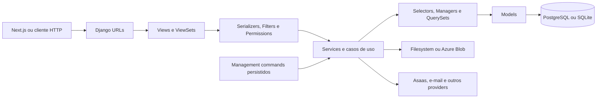
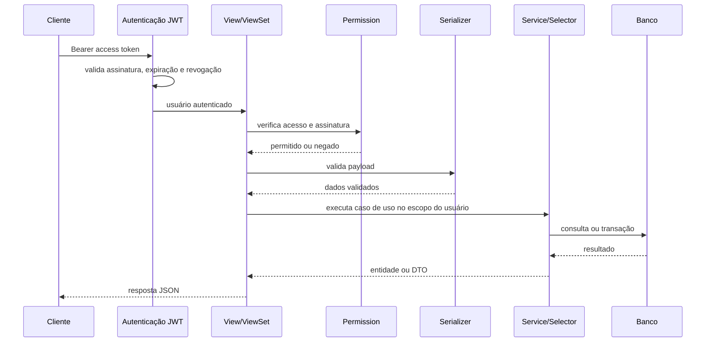

# Arquitetura do backend

## Visão geral

O backend é uma aplicação modular em Django e Django REST Framework. Cada domínio funcional é representado por um app em `backend/apps/`, enquanto configuração, roteamento e entrypoints ASGI/WSGI ficam em `backend/config/`.



## Camadas

### Views, ViewSets e endpoints

Responsáveis por adaptar HTTP ao domínio:

- autenticação e autorização da requisição;
- validação de parâmetros de rota e query string;
- seleção do serializer;
- invocação de services ou selectors;
- transformação de exceções de domínio em respostas HTTP;
- declaração de schema OpenAPI.

Views não devem concentrar regras transacionais nem acessar diretamente infraestrutura externa quando já existe um service ou gateway para isso.

### Serializers, filters e permissions

- serializers validam entrada e representam saída;
- filters encapsulam critérios expostos pela API;
- permissions controlam acesso global e por objeto;
- validações de relacionamento devem confirmar que os objetos pertencem ao mesmo escopo do usuário autenticado.

### Services

Services concentram casos de uso, transações e mudanças de estado. Devem documentar:

- pré-condições;
- parâmetros e retorno;
- exceções de domínio;
- efeitos colaterais;
- uso de `transaction.atomic` e `select_for_update`;
- integrações e tarefas disparadas;
- registros de auditoria relevantes.

### Selectors, managers e querysets

Encapsulam consultas reutilizáveis e regras de visibilidade. São especialmente importantes para:

- isolamento por profissional;
- exclusão lógica de registros inativos;
- confidencialidade por autor;
- otimizações com `select_related` e `prefetch_related`;
- filtros de período, status e domínio.

### Models

Representam entidades, integridade e invariantes persistentes. Constraints, índices, estados, relacionamentos e métodos de mudança de estado devem permanecer documentados junto ao código ou na documentação do domínio.

### Infraestrutura

Clientes externos e adapters ficam em módulos de infraestrutura ou integrações. O fluxo esperado é:

```text
View → Service → Gateway/Client → Serviço externo
```

A integração Asaas, por exemplo, fica abaixo de `apps.billing.infrastructure`, evitando que views conheçam detalhes do provider.

## Fluxo de uma requisição autenticada



## Banco de dados

- PostgreSQL 15 é a referência do Docker Compose e de produção;
- SQLite pode ser usado localmente e em testes quando o comportamento específico do PostgreSQL não for necessário;
- migrations históricas não devem ser reescritas;
- mudanças concorrentes em pagamentos, pacotes, recorrências, numeração documental e estados sensíveis devem usar transação e bloqueio de linha quando previsto pelo domínio.

## Processamento assíncrono

O projeto não depende de Celery na configuração atual. Exportações clínicas e comunicações utilizam filas persistidas no banco e management commands executados como workers. Esse desenho mantém estado, tentativas e falhas auditáveis sem depender de um broker externo.

## Arquivos e storage

- filesystem é aceito no desenvolvimento;
- Azure Blob Storage pode ser habilitado por variáveis de ambiente;
- dados clínicos e documentos devem usar armazenamento privado;
- downloads devem validar vínculo e autorização antes de disponibilizar conteúdo;
- URLs temporárias devem possuir expiração curta.

## Autenticação e segurança

- usuário customizado: `users.User`;
- autenticação padrão: `SubscriptionJWTAuthentication`;
- JWT com rotação de refresh token e blacklist;
- Argon2 como primeiro password hasher;
- campos sensíveis podem ser criptografados com chave própria;
- auditoria deve registrar metadados necessários sem copiar conteúdo clínico integral;
- ambientes de produção devem validar segredos e headers de segurança.

## Multi-tenancy atual

O isolamento existente é majoritariamente por profissional autenticado e relações de propriedade. Não existe uma entidade explícita de clínica/tenant que permita declarar suporte completo a múltiplas clínicas. Consulte [multi-tenancy.md](multi-tenancy.md).

## Direção das dependências

Dependências devem apontar da borda para o domínio:

```text
URLs → Views → Serializers/Permissions → Services/Selectors → Models
```

Models não devem importar views ou serializers. Services não devem depender de detalhes HTTP. Integrações externas devem ser acessadas por interfaces ou gateways próprios.

## Compatibilidade

Alterações exclusivamente documentais devem preservar:

- migrations, tabelas, constraints e índices;
- nomes de rotas e endpoints;
- códigos HTTP e formatos de resposta;
- permissões e autenticação;
- imports públicos cobertos por testes;
- comportamento dos workers e integrações.
