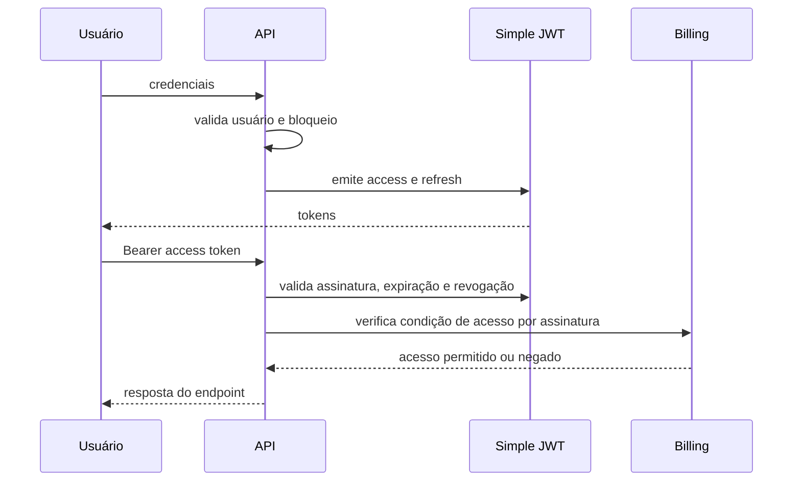

# Autenticação e permissões

## Visão geral

O backend usa um usuário customizado (`users.User`), Django REST Framework e Simple JWT. A autenticação padrão configurada é `SubscriptionJWTAuthentication`, que combina a validação do token com regras de acesso relacionadas à assinatura.

## Fluxo de autenticação



## Access e refresh tokens

Configuração padrão:

- access token: 30 minutos, ajustável por `JWT_ACCESS_MINUTES`;
- refresh token: 7 dias, ajustável por `JWT_REFRESH_DAYS`;
- rotação de refresh token habilitada;
- blacklist do refresh anterior habilitada;
- atualização de último login habilitada;
- claim de revogação vinculada ao hash de senha.

A troca de senha pode invalidar tokens existentes porque a claim de revogação deixa de corresponder ao estado atual do usuário.

## Login e bloqueio de conta

O fluxo de login deve:

1. validar credenciais sem revelar se o e-mail existe;
2. considerar tentativas falhas e janela de bloqueio;
3. limpar ou reduzir o contador após autenticação válida, conforme a regra implementada;
4. registrar somente metadados necessários para segurança;
5. nunca registrar senha, token ou payload completo.

Mensagens públicas devem permanecer genéricas para reduzir enumeração de contas.

## Recuperação de senha

O fluxo deve usar token de uso único e prazo configurado por `PASSWORD_RESET_TIMEOUT`. A resposta pública não deve confirmar a existência da conta.

Após redefinição:

- a senha deve ser reprocessada pelos hashers configurados;
- sessões e tokens incompatíveis devem ser invalidados;
- o evento deve ser auditado sem armazenar a nova senha ou o token;
- links expirados, alterados ou reutilizados devem ser rejeitados.

## Hash de senha

Ordem configurada:

1. Argon2;
2. PBKDF2;
3. PBKDF2-SHA1 para compatibilidade de hashes antigos.

Novas senhas devem ser gravadas pelo primeiro hasher disponível. Hashes legados podem ser atualizados após autenticação válida pelo mecanismo do Django.

## Permissions globais

A configuração padrão do DRF exige `IsAuthenticated`. Endpoints públicos ou de autenticação devem declarar explicitamente permissions diferentes.

Uma permission deve documentar:

- perfis aceitos;
- condições globais;
- regras por objeto;
- ações permitidas;
- motivo das principais negações;
- interação com assinatura, proprietário, autoria e status.

## Permissões por proprietário

O acesso a pacientes, consultas, transações, documentos, formulários e relatórios deve ser limitado ao profissional autenticado ou a uma relação autorizada.

Padrão recomendado:

```python
queryset = Resource.objects.filter(owner=request.user)
```

A filtragem no queryset deve ser complementada por validação de relações recebidas no payload. Uma permission de objeto não corrige um queryset que já expôs dados de outro usuário.

## Prontuário e confidencialidade

Evoluções confidenciais exigem controles adicionais:

- acesso pelo autor ou permission específica;
- preservação da autoria;
- auditoria de leitura e alteração quando aplicável;
- ausência de conteúdo clínico integral em logs;
- proteção de anexos pelo mesmo escopo.

## Administradores e Django Admin

Superusuários e equipe interna podem possuir acesso ampliado no backoffice, mas isso não elimina a necessidade de:

- registrar acesso sensível;
- restringir exportações;
- evitar exibição de segredos;
- revisar permissões por model;
- aplicar princípio do menor privilégio.

Não se deve presumir que todo usuário com acesso ao Admin pode visualizar conteúdo clínico completo.

## Controle por assinatura

O billing pode limitar recursos de usuários sem assinatura válida, em teste expirado, cancelados ou inadimplentes. A regra exata deve ser centralizada em autenticação/permissions ou services de billing, evitando verificações divergentes em cada view.

Estados de assinatura devem distinguir, conforme models e services atuais:

- período de teste;
- ativa;
- em carência;
- vencida ou inadimplente;
- cancelada;
- encerrada.

A documentação OpenAPI deve declarar respostas `403` quando uma assinatura válida for pré-condição.

## Rate limiting

Endpoints de login, recuperação de senha, webhooks e links públicos devem aplicar rate limiting quando configurado. O cache local serve ao desenvolvimento, mas produção distribuída deve usar backend de cache compartilhado se múltiplas instâncias precisarem compartilhar limites.

## Checklist para novas permissions

- [ ] filtra o queryset pelo usuário antes de buscar o objeto;
- [ ] valida relações do payload no mesmo escopo;
- [ ] diferencia permissão global e por objeto;
- [ ] não revela a existência de recurso alheio;
- [ ] considera status ativo/arquivado quando necessário;
- [ ] considera autoria e confidencialidade;
- [ ] considera assinatura quando aplicável;
- [ ] possui testes de acesso permitido e negado;
- [ ] documenta o comportamento no schema OpenAPI.
