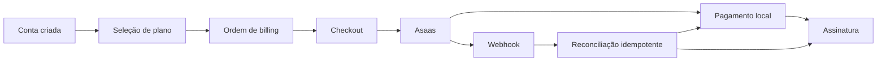

# Billing e integrações externas

## Separação de domínios

O projeto possui dois domínios financeiros distintos:

- `apps.financeiro`: receitas, despesas, mensalidades, pagamentos de pacientes e relatórios do profissional;
- `apps.billing`: planos, assinatura SaaS, checkout, cobranças e integração com o gateway.

Uma alteração em billing não deve criar ou modificar automaticamente transações clínicas sem um caso de uso explícito e documentado.

## Fluxo de assinatura

O fluxo exato de estados deve ser obtido dos models e services atuais. Documentação não deve inventar transições ou métodos de pagamento não implementados.

## Planos e teste gratuito

Configurações relevantes:

- `BILLING_ENABLED`;
- `BILLING_TRIAL_DAYS`;
- `BILLING_DEFAULT_CURRENCY`;
- `BILLING_GRACE_PERIOD_DAYS`;
- `BILLING_MAX_INSTALLMENTS`.

A criação de conta e início do teste devem ser idempotentes, evitando múltiplas assinaturas ou períodos de teste duplicados para o mesmo usuário.

## Ordens, pagamentos e assinatura

Services devem centralizar:

- criação da ordem;
- seleção do gateway;
- criação ou reutilização de cliente externo;
- checkout;
- upsert de pagamento;
- atualização da assinatura;
- cancelamento;
- reconciliação;
- tratamento de inadimplência e carência.

Views não devem manipular diretamente models e cliente Asaas no mesmo fluxo.

## Integração Asaas

Configuração:

- `ASAAS_API_KEY`;
- `ASAAS_BASE_URL`;
- `ASAAS_WEBHOOK_TOKEN`.

O ambiente local usa por padrão a URL de sandbox. Produção deve configurar explicitamente a URL correta e uma chave própria.

O client deve documentar:

- endpoints remotos utilizados;
- timeouts;
- erros traduzidos para exceções de domínio;
- política de retry;
- idempotência;
- campos externos persistidos;
- diferenças entre sandbox e produção.

Nunca registre a API key, token de webhook, dados bancários completos ou payload integral com informações pessoais.

## Checkout

A criação de checkout deve validar:

- usuário e plano;
- moeda;
- quantidade de parcelas;
- estado atual da assinatura;
- expiração configurada;
- chave de idempotência quando suportada;
- disponibilidade do gateway.

Falhas de configuração devem gerar erro operacional claro sem expor o valor do segredo ausente.

## Webhooks

Fluxo seguro:

1. receber evento em endpoint específico;
2. validar `ASAAS_WEBHOOK_TOKEN` ou mecanismo equivalente;
3. extrair identificador único do evento;
4. persistir o evento antes do processamento;
5. ignorar duplicatas já concluídas;
6. aplicar transação e bloqueio quando houver disputa;
7. atualizar pagamento e assinatura;
8. registrar status, tentativa e erro sanitizado;
9. permitir reconciliação posterior.

Estados de processamento de webhook devem distinguir recebido, processando, concluído e falho quando o model oferecer esses campos.

## Reconciliação

A reconciliação consulta o gateway para corrigir eventos atrasados ou perdidos.

Configurações:

- `BILLING_RECONCILIATION_ENABLED`;
- `BILLING_RECONCILIATION_INTERVAL_MINUTES`;
- `BILLING_WEBHOOK_MAX_RETRIES`;
- `BILLING_WEBHOOK_PROCESS_INLINE`.

Processamento inline deve permanecer restrito a desenvolvimento e testes quando o comentário de configuração assim determina. Produção deve usar o fluxo persistido previsto pelo projeto.

## E-mail

Configurações SMTP:

- `EMAIL_BACKEND`;
- `DEFAULT_FROM_EMAIL`;
- `EMAIL_HOST`;
- `EMAIL_PORT`;
- `EMAIL_HOST_USER`;
- `EMAIL_HOST_PASSWORD`;
- `EMAIL_USE_TLS`;
- `EMAIL_TIMEOUT`.

Desenvolvimento usa backend de console por padrão. Produção deve configurar provider real, remetente verificado, TLS e timeout.

## Azure Blob Storage

Configurações:

- `AZURE_STORAGE_CONNECTION_STRING`;
- `AZURE_CONTAINER_NAME`;
- `AZURE_URL_EXPIRATION_SECS`;
- `PRIVATE_MEDIA_STORAGE_REQUIRED`.

Arquivos clínicos devem ficar em container privado. URLs temporárias devem expirar rapidamente e ser geradas somente após autorização local.

## Comunicações

O app de comunicações suporta infraestrutura para:

- e-mail;
- notificações internas;
- WhatsApp quando provider oficial estiver configurado;
- SMS quando provider estiver configurado;
- webhooks de status;
- templates e automações.

Variáveis de WhatsApp e SMS vazias devem manter os canais desativados, em vez de simular envio bem-sucedido.

## Geração de PDF

WeasyPrint é usado para geração de PDFs. Services de documentos e exportações devem:

- renderizar conteúdo sanitizado;
- usar assets permitidos;
- evitar acesso arbitrário a URLs locais;
- calcular hash de integridade quando previsto;
- persistir arquivo em storage privado;
- registrar falhas sem incluir conteúdo clínico integral.

## Timeouts e retries

Toda integração de rede deve possuir timeout finito. Retries devem ocorrer apenas para falhas transitórias e respeitar idempotência.

Não repita automaticamente:

- requisição que possa duplicar cobrança sem chave idempotente;
- erro de validação `4xx` permanente;
- autenticação inválida;
- operação cancelada pelo usuário.

## Testes de integrações

- clients simulados, sem chamadas reais no teste unitário;
- timeout e erro de rede;
- payload inválido;
- autenticação ausente;
- webhook duplicado;
- evento fora de ordem;
- reconciliação após evento perdido;
- cobrança fora do escopo do usuário;
- sandbox e produção selecionados por configuração;
- ausência de segredo em logs e respostas.
