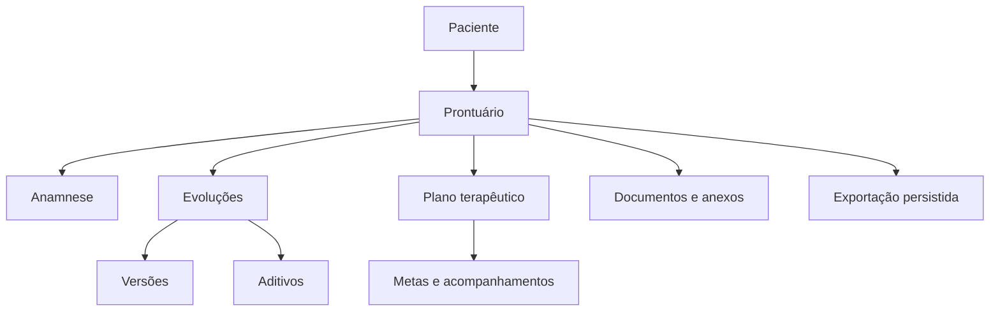

# Prontuário e dados clínicos

## Escopo

O app `records` concentra o prontuário eletrônico e seus artefatos: anamnese, evoluções, versões, aditivos, plano terapêutico, metas, acompanhamentos, documentos, anexos e exportações.

Esses dados exigem controles adicionais de acesso, autoria, integridade, confidencialidade, retenção e auditoria.

## Organização do prontuário



A estrutura exata deve ser confirmada nos models e migrations antes de qualquer mudança funcional.

## Autoria

Toda entrada clínica deve preservar o autor responsável. A autoria não deve ser derivada apenas do último usuário que alterou o registro.

Services de criação e atualização devem receber explicitamente o usuário autenticado e registrar:

- autor original;
- responsável pela alteração;
- timestamps;
- versão ou aditivo quando necessário;
- metadados mínimos de auditoria.

## Regra de edição e aditivos

O domínio prevê janela limitada de edição das evoluções e uso de aditivo após o bloqueio. A implementação atual deve permanecer como fonte de verdade para o cálculo da janela e as exceções permitidas.

Regras esperadas:

1. a evolução é criada com autoria e horário;
2. dentro da janela configurada, alterações permitidas geram versionamento;
3. após o bloqueio, o conteúdo original não é sobrescrito;
4. correções posteriores são registradas como aditivo;
5. o histórico permanece consultável e auditável;
6. arquivamento não elimina o histórico.

Não altere o prazo, a forma de cálculo ou os perfis autorizados em uma mudança exclusivamente documental.

## Confidencialidade

Evoluções marcadas como confidenciais devem ser retornadas somente ao autor ou a perfis explicitamente autorizados. O filtro deve ser aplicado em selectors/querysets antes da serialização.

Cuidados:

- não incluir trechos confidenciais em listagens genéricas;
- não usar busca textual que ignore o filtro de autoria;
- não expor conteúdo no Django Admin sem permission específica;
- não registrar corpo clínico em logs, exceptions ou auditoria;
- aplicar a mesma regra aos anexos e exportações.

## Anamnese

A anamnese pode conter dados pessoais, familiares, de saúde e histórico do paciente. Sua documentação deve explicar:

- vínculo com paciente e profissional;
- estados de rascunho, conclusão ou revisão, quando existirem;
- campos criptografados;
- regras de atualização;
- autoria;
- exportação;
- acesso administrativo.

Serializers devem distinguir campos de leitura, escrita e dados calculados sem expor informações além do necessário.

## Plano terapêutico, metas e acompanhamento

O plano terapêutico organiza objetivos e intervenções definidos pelo profissional. Mudanças relevantes devem preservar histórico quando a implementação assim determinar.

Metas e acompanhamentos devem permanecer vinculados ao mesmo paciente e profissional. Relações recebidas no payload precisam ser validadas no mesmo escopo.

## Documentos e anexos

Uploads clínicos devem validar:

- extensão permitida;
- MIME type;
- assinatura real do arquivo quando aplicável;
- tamanho máximo;
- nome seguro;
- vínculo com paciente e prontuário;
- storage privado;
- autorização no download.

O nome original pode ser preservado para exibição, mas não deve ser usado diretamente como caminho de armazenamento.

## Criptografia

Campos textuais sensíveis podem usar a infraestrutura de criptografia do `core`. A chave `FIELD_ENCRYPTION_KEY` deve ser independente de `SECRET_KEY` e `JWT_SECRET`.

Rotação de chave exige planejamento, suporte temporário a chave anterior e migração verificável. Perder todas as chaves torna o conteúdo criptografado irrecuperável.

## Auditoria

Eventos relevantes:

- criação e alteração de anamnese;
- criação, edição, arquivamento e aditivo de evolução;
- acesso a conteúdo confidencial;
- upload e download de anexos;
- geração e download de exportação;
- mudança de autoria ou permissão, quando suportada.

A auditoria deve registrar identificadores e ação, sem copiar o conteúdo clínico completo.

## Exportações

Exportações clínicas são representadas por jobs persistidos e processadas por worker. Ciclo de vida esperado:

```text
PENDING → PROCESSING → COMPLETED
                    ↘ FAILED
PENDING/COMPLETED → EXPIRED
```

O worker deve:

- selecionar jobs disponíveis de forma concorrente segura;
- reaplicar o escopo do solicitante;
- atualizar status e timestamps;
- registrar erro sanitizado;
- persistir arquivo em storage privado;
- limitar tentativas ou permitir reprocessamento controlado;
- expirar e limpar artefatos conforme política definida.

## LGPD e minimização

Controles técnicos não substituem avaliação jurídica. O backend deve apoiar:

- finalidade clara;
- minimização dos dados;
- acesso restrito;
- rastreabilidade;
- retenção definida;
- exportação segura;
- correção sem destruição indevida do histórico;
- descarte controlado quando juridicamente permitido.

## Testes essenciais

- criação de evolução com autor correto;
- edição dentro da janela permitida;
- bloqueio fora da janela;
- criação de aditivo sem alterar o original;
- histórico de versões;
- confidencialidade por autor;
- isolamento entre profissionais;
- validação de upload inválido;
- download autorizado e negado;
- worker de exportação concorrente;
- transições `PENDING`, `PROCESSING`, `COMPLETED`, `FAILED` e `EXPIRED`;
- ausência de conteúdo clínico em logs e auditoria.
